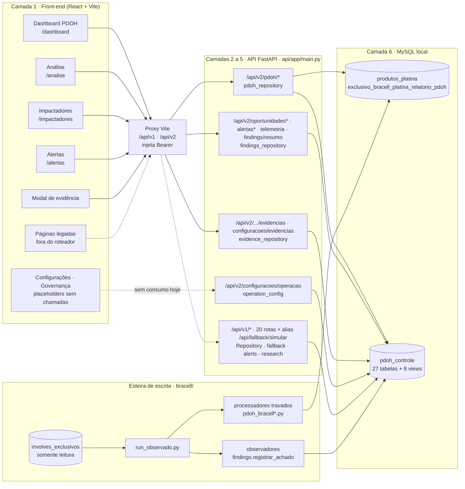
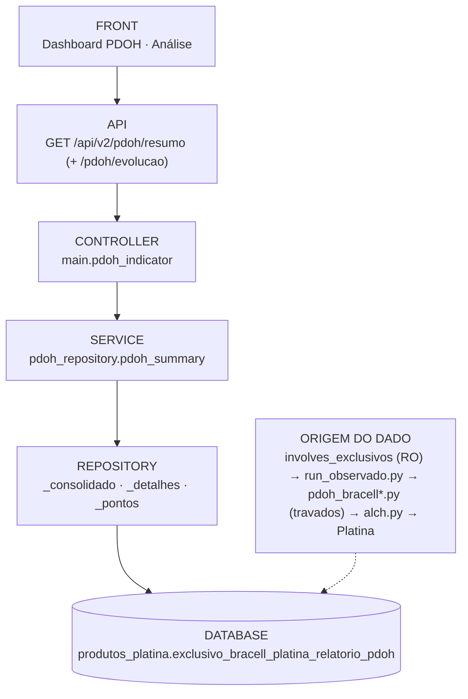
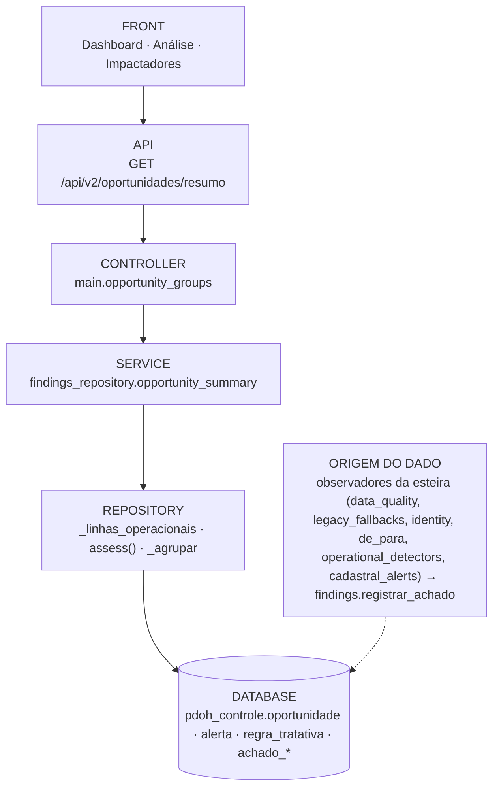
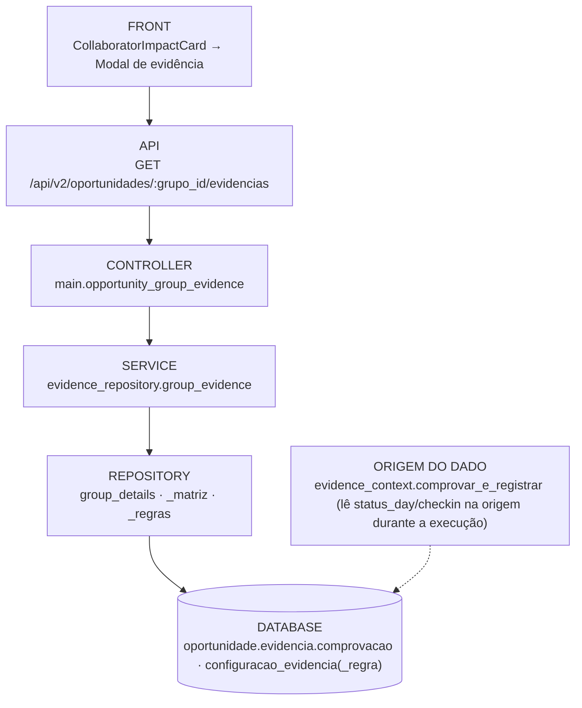
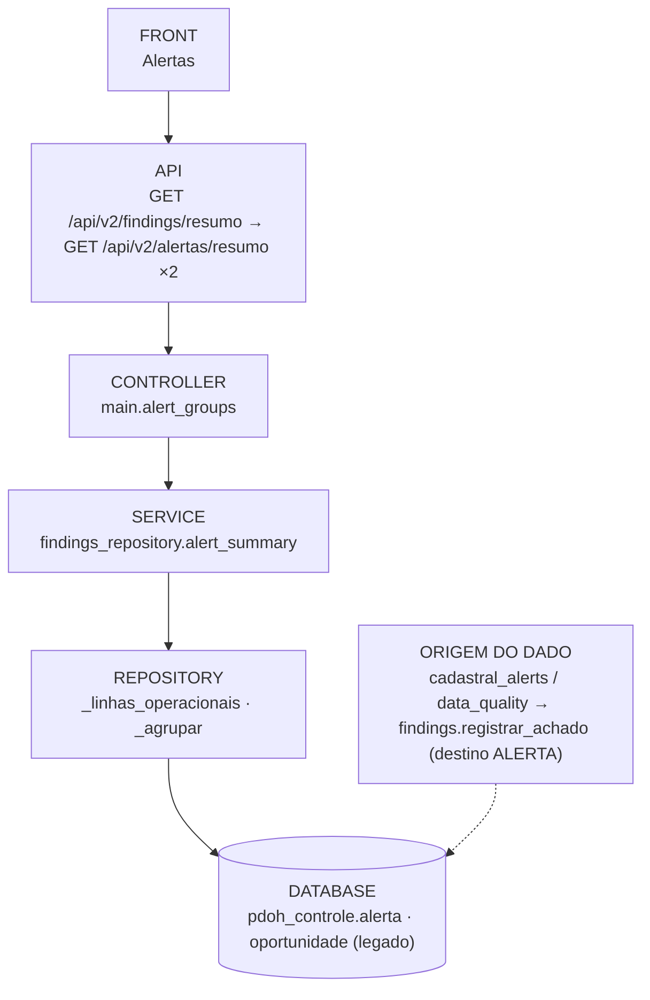
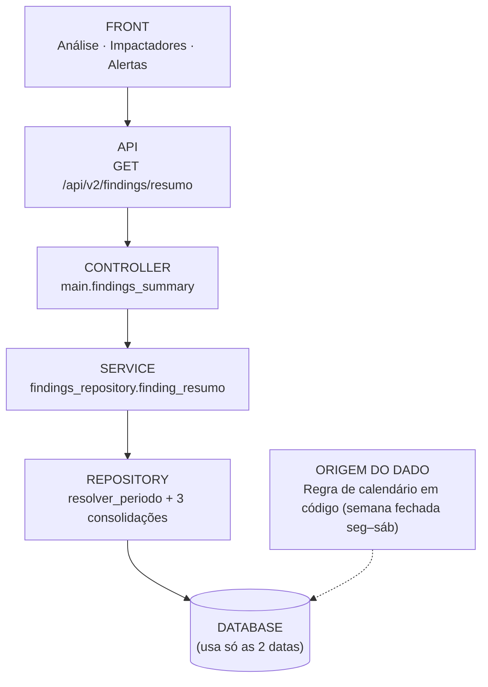
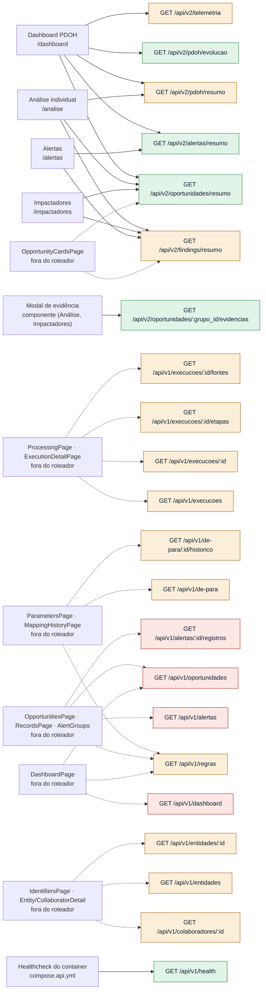

# Mapa de Arquitetura de Endpoints — PDOH_CX

> Levantamento estático de **21/09/2026** sobre a working tree da branch `codex/fix-cd-artifacts` (inclui `api/` e `frontend/`, ainda não versionados).
> **Somente documentação**: nenhum código, endpoint, banco ou configuração foi alterado.
>
> Artefatos irmãos: [`endpoint_inventory.json`](endpoint_inventory.json) (dados estruturados) · [`endpoint_architecture_map.html`](endpoint_architecture_map.html) (mapa navegável — abra no navegador).

## Sumário

1. Visão geral em números
2. Como as camadas foram lidas
3. Diagrama geral
4. Fluxos críticos
5. Mapa de consumo: telas → endpoints
6. Visão por colunas (7 camadas)
7. Ficha por endpoint
8. Duplicidades
9. Tabelas e views
10. Regras em código que poderiam ser configuração
11. Pontos de atenção arquitetural
12. Sugestões de organização
13. Método e limites

## 1. Visão geral em números

**35 endpoints** registrados em `api/app/main.py` (conferido com `artifacts/api-openapi.json`: 35 paths / 35 operações). Versão: **14 v2**, **20 v1** e **1 sem versão**. Todos são somente leitura: 33 GET e 2 POST (o mesmo handler de simulação, sem escrita, em duas rotas). Rotas automáticas do FastAPI (`/docs`, `/redoc`, `/openapi.json`) não entram na contagem.

| Classificação | Qtd | Critério |
|---|---:|---|
| 🟢 Manter | 5 | Endpoint utilizado e com responsabilidade clara. |
| 🟡 Avaliar | 23 | Possível duplicidade, responsabilidade misturada ou sem consumidor ativo com uso futuro previsto. |
| 🔴 Revisar | 7 | Sem uso identificado, substituído por outro endpoint ou arquitetura inadequada. |

| Consumo | Qtd |
|---|---:|
| Ativo — consumido pela interface | 7 |
| Ativo na API — consumido apenas por páginas legadas fora do roteador | 14 |
| Ativo na API — sem consumidor na interface (apenas scripts/testes ou uso interno) | 13 |
| Ativo — consumido pela infraestrutura | 1 |

**Por módulo (domínio funcional)**

| Módulo | Endpoints | 🟢 | 🟡 | 🔴 |
|---|---:|---:|---:|---:|
| Indicador PDOH | 4 | 1 | 2 | 1 |
| Oportunidades · fila operacional | 4 | 2 | 2 | 0 |
| Alertas | 2 | 1 | 1 | 0 |
| Telemetria e resumo | 2 | 0 | 2 | 0 |
| Configurações | 2 | 0 | 2 | 0 |
| Fallback | 3 | 0 | 2 | 1 |
| Rastreabilidade de execuções | 5 | 0 | 5 | 0 |
| Catálogo · regras e De/Para | 3 | 0 | 3 | 0 |
| Identidade | 3 | 0 | 3 | 0 |
| Consulta v1 legada | 6 | 0 | 1 | 5 |
| Operação | 1 | 1 | 0 | 0 |

**Por arquivo de backend (onde está o service)**

| Arquivo | Endpoints |
|---|---:|
| `api/app/repository.py` | 17 |
| `api/app/findings_repository.py` | 7 |
| `api/app/pdoh_repository.py` | 4 |
| `api/app/fallback.py` | 3 |
| `api/app/evidence_repository.py` | 2 |
| `api/app/operation_config.py` | 1 |
| `api/app/main.py` | 1 |

## 2. Como as camadas foram lidas

O backend é FastAPI sem classes de controller/service/repository. Para seguir a estrutura pedida, cada camada foi mapeada assim:

| Camada pedida | O que é no PDOH_CX |
|---|---|
| 1 · Front-end | Rota do `react-router` (`frontend/src/app.tsx`) → página → componente → função de `src/services/*` |
| 2 · Endpoint | Rota registrada em `create_app()` (`api/app/main.py`), exposta ao navegador pelo proxy do Vite (`/api/v1`, `/api/v2` + Bearer) |
| 3 · Módulo backend (controller) | Handler da rota em `main.py` + tag OpenAPI; agrupado aqui por domínio funcional |
| 4 · Service | Função pública de `pdoh_repository`, `findings_repository`, `evidence_repository`, `operation_config`, `fallback` ou método da classe `Repository` |
| 5 · Repository | Funções privadas de acesso a dados (`_linhas`, `_linhas_operacionais`, `_catalogo_por_tipo`…) e helpers SQL da classe `Repository` (`page`, `one`, `children`, `period_conditions`) |
| 6 · Banco | MySQL local: `produtos_platina` (só a tabela oficial do PDOH) e `pdoh_controle.*`. A API não alcança a origem `involves_exclusivos` |
| Entidades | Modelos Pydantic de resposta (`*_models.py`) e tabelas refletidas em `database.TABLE_MODELS` |

**Front-end — rotas ativas**

| Rota | Página | Chamadas |
|---|---|---|
| `/login` | LoginPage | Sessão externa (VITE_CX_PDOH_SESSION_URL) ou sessão demo em DEV — fora da API PDOH_CX |
| `/dashboard` | PdohDashboardPage | /api/v2/pdoh/resumo, /api/v2/oportunidades/resumo (todas as páginas), /api/v2/alertas/resumo, /api/v2/telemetria, /api/v2/pdoh/evolucao |
| `/analise` | AnalysisPage | /api/v2/findings/resumo (período), /api/v2/oportunidades/resumo (todas as páginas), /api/v2/pdoh/resumo; modal → /evidencias |
| `/impactadores` | ImpactPage | /api/v2/findings/resumo (período), /api/v2/oportunidades/resumo (todas as páginas + página atual); modal → /evidencias |
| `/alertas` | AlertsPage | /api/v2/findings/resumo (período), /api/v2/alertas/resumo (consolidado + página) |
| `/configuracoes` | SettingsPage | nenhuma (placeholder) |
| `/governanca` | GovernancePage | nenhuma (placeholder) |
| `/oportunidades` | redirect → /impactadores | — |
| `/oportunidades/* e /processamentos/*` | PreviousConsultationPage (texto estático) | nenhuma |
| `/operacoes e *` | redirect → /dashboard | — |

**Front-end — services e infraestrutura de chamada**

- `frontend/src/services/pdoh-api.ts` — Cliente HTTP base: apiRequest() faz fetch em /api/{v1|v2} e valida com zod; schemas v1; queryString().
- `frontend/src/services/operational-api.ts` — Cliente v2 da fila: v2Request, resolvePeriod, loadGroups, loadAllPages/loadAllGroups, loadAlerts, loadAlertGroups, loadTelemetry, loadGroupEvidence, loadGroupDetails (sem uso), filtersFromSearch.
- `frontend/src/services/findings-service.ts` — Orquestra o Dashboard (loadPdohOverview) e consolida grupos já agrupados pela API (impactosPorRegra/Colaborador).
- `frontend/src/services/pdoh-indicator.ts` — Contratos e caminhos do indicador (PDOH_SUMMARY_PATH, PDOH_TREND_PATH) e estados de exibição.
- `frontend/src/services/opportunity-service.ts` — Cliente v1 (loadCatalog, opportunityService.list/summary/dashboard) — usado só por páginas legadas.
- `frontend/src/hooks/use-pdoh-resource.ts` — Hook genérico de carga com AbortController, chave de cache e retry.
- `frontend/vite.config.ts` — Proxy /api/v1 e /api/v2 → PDOH_CONSULTA_URL (padrão 127.0.0.1:8000), injeta Bearer lido de api/.env.api no servidor.
- `frontend/src/auth/auth-provider.tsx` — Sessão via serviço de identidade externo ou sessão demo em desenvolvimento.

**Front-end — código fora do roteador** (compilado, mas inalcançável pela navegação):

- src/pages/platform-pages.tsx (DashboardPage, ProcessingPage, ExecutionDetailPage)
- src/pages/opportunities-page.tsx (OpportunitiesPage, OpportunityDetailPage, OpportunityRecordsPage, OpportunitySummary)
- src/pages/opportunity-cards-page.tsx (OpportunityCardsPage e um 2º PreviousConsultationPage)
- src/pages/identifiers-page.tsx (IdentifiersPage, EntityDetailPage, CollaboratorDetailPage)
- src/pages/parameters-page.tsx (ParametersPage, MappingHistoryPage)
- components/platform: brand-dashboard, catalog-summary (só usado por brand-dashboard, que não é usado), alert-groups, operational-group-card, impact-list, metric-card, pdoh-indicator-card, opportunity-detail (stub de 14 linhas), page-header; DateFilters em query-controls

**Backend — módulos**

- `api/app/main.py` — Controller: create_app() registra as 35 rotas (sem APIRouter), autenticação Bearer, CORS, handlers de erro.
- `api/app/database.py` — Engine read-only (SET SESSION TRANSACTION READ ONLY, só SELECT/SHOW/DESCRIBE), validação de GRANTs, reflexão das tabelas (TABLE_MODELS) e mapa PLATINA_PDOH por marca.
- `api/app/pdoh_repository.py` — Service+repository do indicador PDOH (Platina).
- `api/app/findings_repository.py` — Service+repository da fila v2: período, classificação, agrupamento em memória, detalhes, resumos.
- `api/app/evidence_repository.py` — Service da comprovação (evidências) e da matriz de evidência.
- `api/app/operation_config.py` — Service da configuração da operação (somente leitura).
- `api/app/fallback.py` — Resolução e simulação de fallback (SQL direto).
- `api/app/repository.py` — Classe Repository: helpers SQL genéricos (page, one, children, period_conditions) e as consultas v1.
- `api/app/alerts.py / research.py` — Agrupamento de alertas v1 e diagnóstico fixo de campos de pesquisa.
- `api/app/*_models.py, models.py` — Entidades/contratos Pydantic de resposta e filtros.
- `shared/*.py` — Regras compartilhadas API + esteira: operational_policy.assess, evidence_config, evidence_engine, journey, geography.

**Dados — bancos**

- `produtos_platina` — Saída oficial do PDOH (Platina). Lida pela API só na tabela oficial por marca.
- `pdoh_controle` — Controle/observabilidade: execuções, achados, catálogo, configuração, identidade. API tem SELECT em pdoh_controle.*.
- `involves_exclusivos / involves_bracell` — Origem BRACELL. Somente a esteira lê; a API não tem acesso.
- `produtos (Gold)` — Referência da aplicação original para validação; fora do escopo da API.
- Origem da esteira: involves_exclusivos (MySQL remoto, somente leitura) — ou involves_bracell local em desenvolvimento. Somente a esteira (bracell/src/database.criar_engine_origem, read-only forçado). A API não alcança a origem. Tabelas: `status_day_operacao_bracell`, `colaboradores_ativos_bracell`, `relatorio_checkin_bracell`, `gerencial_visitas_bracell`, `painel_pesquisas_bracell`.

## 3. Diagrama geral



Setas contínuas: consumo ativo. Tracejadas: consumo só por código legado ou previsto.

## 4. Fluxos críticos

### F1 · Indicador PDOH



### F2 · Fila de impactadores (oportunidades)



### F3 · Evidência do modal operacional



### F4 · Pendências cadastrais (alertas)



### F5 · Janela de período



## 5. Mapa de consumo: telas → endpoints

Somente o que a navegação alcança hoje, mais as páginas legadas agrupadas. Cor = classificação.



**Sem nenhum consumidor no front (13):** `GET /api/v2/pdoh/composicao`, `GET /api/v2/pdoh/colaborador/{id}`, `GET /api/v2/oportunidades/{grupo_id}/detalhes`, `GET /api/v2/oportunidades`, `GET /api/v2/alertas`, `GET /api/v2/configuracoes/evidencias`, `GET /api/v2/configuracoes/operacao`, `GET /api/v1/fallback/resolver`, `POST /api/v1/fallback/simular`, `POST /api/fallback/simular`, `GET /api/v1/execucoes/{id}/linhagem`, `GET /api/v1/oportunidades/{id}`, `GET /api/v1/oportunidades/{id}/historico`.

## 6. Visão por colunas (7 camadas)

Uma linha por endpoint. Coluna 1 lista a tela e o componente; `(legado)` = página fora do roteador.

### Indicador PDOH

_Resultado oficial lido da Platina: resumo, composição, evolução e colaborador._

| 1 · Tela / componente | 2 · Endpoint | 3 · Módulo backend | 4 · Service | 5 · Repository | 6 · Banco / tabelas | 7 · Observações |
|---|---|---|---|---|---|---|
| Dashboard PDOH › PdohResult · PdohComposition · PdohDailyValidation · filtros<br>Análise individual › PdohResult · PdohComposition | 🟡 `GET /api/v2/pdoh/resumo` | Indicador PDOH<br>`main.py:132` pdoh_indicator | `pdoh_repository.pdoh_summary` | `pdoh_repository._resolver_fonte`<br>`_detalhes`<br>`_opcoes_filtro`<br>`_consolidado → _cobertura/_linhas`<br>`_pontos`<br>`_auditoria_jornada`<br>`findings_repository.resolver_periodo` | `produtos_platina.exclusivo_bracell_platina_relatorio_pdoh`<br>`pdoh_controle.jornada_consolidada`<br>`pdoh_controle.fallback_evento`<br>`pdoh_controle.execucao` | Endpoint central do painel: manter. Acumula 5 responsabilidades (KPI, composição, série diária, detalhe diário paginado e opções de filtro) em ~10 SELECTs e 3 leituras completas da janela da Platina (atual, anterior e série). O campo `evolucao` é calculado e não é lido pelo front (a curva usa /pdoh/evolucao). `composicao` repete /pdoh/composicao. Filtro de colaborador usa LIKE '%nome%'. Meta PDOH não cadastrada (_meta devolve None). |
| _sem consumidor na UI_ | 🔴 `GET /api/v2/pdoh/composicao` | Indicador PDOH<br>`main.py:136` pdoh_composition | `pdoh_repository.pdoh_composicao` | `pdoh_repository._resolver_fonte`<br>`_consolidado → _cobertura/_linhas`<br>`findings_repository.resolver_periodo` | `produtos_platina.exclusivo_bracell_platina_relatorio_pdoh` | Nenhuma tela chama. É um subconjunto exato de /pdoh/resumo (campos `composicao`/`indicadores`). Decidir: remover, ou enxugar /pdoh/resumo e usar este como fonte da composição. |
| Dashboard PDOH › PdohTrend (curva) | 🟢 `GET /api/v2/pdoh/evolucao` | Indicador PDOH<br>`main.py:140` pdoh_trend | `pdoh_repository.pdoh_evolucao` | `pdoh_repository._cobertura`<br>`_pontos → _linhas/_fatiar/_consolidar`<br>`findings_repository.resolver_periodo` | `produtos_platina.exclusivo_bracell_platina_relatorio_pdoh` | Responsabilidade clara. Com granularidade=dia repete o cálculo que /pdoh/resumo já faz no campo `evolucao`. |
| _sem consumidor na UI_ | 🟡 `GET /api/v2/pdoh/colaborador/{id}` | Indicador PDOH<br>`main.py:144` pdoh_collaborator | `pdoh_repository.pdoh_colaborador`<br>→ `findings_repository.opportunity_summary` | `pdoh_repository._resolver_colaborador`<br>`_consolidado`<br>`_impactadores → findings_repository.opportunity_summary` | `produtos_platina.exclusivo_bracell_platina_relatorio_pdoh`<br>`pdoh_controle.colaborador_identidade`<br>`pdoh_controle.regra_tratativa`<br>`pdoh_controle.oportunidade`<br>`pdoh_controle.alerta`<br>`pdoh_controle.execucao`<br>`pdoh_controle.execucao_contexto`<br>`pdoh_controle.achado_revisao`<br>`pdoh_controle.achado_roteamento`<br>`pdoh_controle.oportunidade_grupo_status` | Pronto para o drill-down do colaborador, mas a tela Análise remonta o mesmo resultado com /pdoh/resumo?colaborador= e /oportunidades/resumo?colaborador=. Acopla indicador e fila no mesmo endpoint. Id opaco (base64 marca+nome) difere do UUID de /api/v1/colaboradores/{id}. |

### Oportunidades · fila operacional

_Achados classificados como OPORTUNIDADE, agrupados por problema, com evidência._

| 1 · Tela / componente | 2 · Endpoint | 3 · Módulo backend | 4 · Service | 5 · Repository | 6 · Banco / tabelas | 7 · Observações |
|---|---|---|---|---|---|---|
| Dashboard PDOH › ImpactCard (ranking por regra)<br>Análise individual › CollaboratorImpactCard<br>Impactadores › ImpactCard · CollaboratorImpactCard<br>OpportunityCardsPage (legado) › OperationalGroupCard | 🟢 `GET /api/v2/oportunidades/resumo` | Oportunidades · fila operacional<br>`main.py:111` opportunity_groups | `findings_repository.opportunity_summary` | `findings_repository._catalogo_por_tipo`<br>`_linhas_operacionais`<br>`_agrupar`<br>`_base_card`<br>`_status_efetivo`<br>`_pagina_em_memoria`<br>`shared.operational_policy.assess`<br>`evidence_repository.evidencia_resumida/resumo_validacao` | `pdoh_controle.regra_tratativa`<br>`pdoh_controle.oportunidade`<br>`pdoh_controle.alerta`<br>`pdoh_controle.execucao`<br>`pdoh_controle.execucao_contexto`<br>`pdoh_controle.achado_revisao`<br>`pdoh_controle.achado_roteamento`<br>`pdoh_controle.oportunidade_grupo_status` | Fila oficial. Agrupamento e paginação em memória: cada página relê até 100.000 linhas e recalcula todos os grupos; loadAllGroups pede páginas de 200, multiplicando o recálculo. `oportunidade_grupo_status` não tem escritor no repositório, então o status é sempre derivado (ABERTA/REABERTA). |
| _sem consumidor na UI_ | 🟡 `GET /api/v2/oportunidades/{grupo_id}/detalhes` | Oportunidades · fila operacional<br>`main.py:115` opportunity_group_details | `findings_repository.group_details` | `findings_repository.decodificar_grupo`<br>`_linhas_operacionais`<br>`_catalogo_por_tipo`<br>`select oportunidade_grupo_status` | `pdoh_controle.regra_tratativa`<br>`pdoh_controle.oportunidade`<br>`pdoh_controle.alerta`<br>`pdoh_controle.execucao`<br>`pdoh_controle.execucao_contexto`<br>`pdoh_controle.achado_revisao`<br>`pdoh_controle.achado_roteamento`<br>`pdoh_controle.oportunidade_grupo_status` | loadGroupDetails() existe no front mas não é chamado. /evidencias executa group_details internamente e devolve um superconjunto. Varre todas as linhas operacionais do período para filtrar um único grupo. |
| Modal de evidência › OpportunityDetail (modal) | 🟢 `GET /api/v2/oportunidades/{grupo_id}/evidencias` | Oportunidades · fila operacional<br>`main.py:123` opportunity_group_evidence | `evidence_repository.group_evidence`<br>→ `findings_repository.group_details` | `evidence_repository._matriz`<br>`_regras`<br>`comprovacao_da_evidencia`<br>`findings_repository.group_details`<br>`shared.evidence_config` | `pdoh_controle.configuracao_evidencia`<br>`pdoh_controle.configuracao_evidencia_regra`<br>`pdoh_controle.regra_tratativa`<br>`pdoh_controle.oportunidade`<br>`pdoh_controle.alerta`<br>`pdoh_controle.execucao`<br>`pdoh_controle.execucao_contexto`<br>`pdoh_controle.achado_revisao`<br>`pdoh_controle.achado_roteamento`<br>`pdoh_controle.oportunidade_grupo_status` | Base do modal operacional. A API não reconsulta a origem: achado gravado antes do motor de evidências aparece como 'Evidência indisponível'. O catálogo de regras é carregado 2× por requisição. |
| _sem consumidor na UI_ | 🟡 `GET /api/v2/oportunidades` | Oportunidades · fila operacional<br>`main.py:95` operational_findings | `findings_repository.finding_page` | `findings_repository.finding_page (UNION SQL)`<br>`_regra_por_tipo (subconsulta)`<br>`_classificacao_efetiva`<br>`Repository.period_conditions/page` | `pdoh_controle.oportunidade`<br>`pdoh_controle.execucao`<br>`pdoh_controle.achado_roteamento`<br>`pdoh_controle.regra_tratativa` | Critério de classificação diferente da fila /oportunidades/resumo (que usa assess(), achado_revisao e exclui execuções de VALIDACAO): a mesma pergunta pode ter totais diferentes. Duplica /api/v1/oportunidades. |

### Alertas

_Pendências cadastrais/qualidade classificadas como ALERTA._

| 1 · Tela / componente | 2 · Endpoint | 3 · Módulo backend | 4 · Service | 5 · Repository | 6 · Banco / tabelas | 7 · Observações |
|---|---|---|---|---|---|---|
| Dashboard PDOH › AlertCategoryRow<br>Alertas › AlertCard · AlertCategoryRow | 🟢 `GET /api/v2/alertas/resumo` | Alertas<br>`main.py:119` alert_groups | `findings_repository.alert_summary` | `findings_repository._catalogo_por_tipo`<br>`_linhas_operacionais`<br>`_agrupar`<br>`_base_card`<br>`_pagina_em_memoria`<br>`shared.operational_policy.assess` | `pdoh_controle.regra_tratativa`<br>`pdoh_controle.oportunidade`<br>`pdoh_controle.alerta`<br>`pdoh_controle.execucao`<br>`pdoh_controle.execucao_contexto`<br>`pdoh_controle.achado_revisao`<br>`pdoh_controle.achado_roteamento` | A tela Alertas chama 2× (consolidado sem tipo/regra e página filtrada) — intencional, mas cada chamada refaz o agrupamento completo em memória. Sem teste automatizado que chame a rota. |
| _sem consumidor na UI_ | 🟡 `GET /api/v2/alertas` | Alertas<br>`main.py:99` alert_findings | `findings_repository.finding_page` | `findings_repository.finding_page (UNION SQL oportunidade + alerta)`<br>`_regra_por_tipo` | `pdoh_controle.oportunidade`<br>`pdoh_controle.alerta`<br>`pdoh_controle.execucao`<br>`pdoh_controle.achado_roteamento`<br>`pdoh_controle.regra_tratativa` | Sem consumidor na UI. Terceira leitura de 'alerta' com critério próprio (v1 /alertas e v2 /alertas/resumo são as outras). |

### Telemetria e resumo

_Eventos técnicos e o resumo agregado de achados._

| 1 · Tela / componente | 2 · Endpoint | 3 · Módulo backend | 4 · Service | 5 · Repository | 6 · Banco / tabelas | 7 · Observações |
|---|---|---|---|---|---|---|
| Dashboard PDOH › — (resposta não renderizada) | 🟡 `GET /api/v2/telemetria` | Telemetria e resumo<br>`main.py:103` telemetry_findings | `findings_repository.telemetry_page` | `findings_repository._linhas_operacionais('TELEMETRIA')`<br>`selects em execucao_evento/fallback_evento`<br>`_pagina_em_memoria` | `pdoh_controle.oportunidade`<br>`pdoh_controle.alerta`<br>`pdoh_controle.execucao`<br>`pdoh_controle.execucao_contexto`<br>`pdoh_controle.achado_revisao`<br>`pdoh_controle.achado_roteamento`<br>`pdoh_controle.regra_tratativa`<br>`pdoh_controle.execucao_evento`<br>`pdoh_controle.fallback_evento` | Chamada desperdiçada: o Dashboard carrega e não exibe (a Governança define telemetria fora do painel do líder). Paginação em memória. |
| Análise individual › — (usa só `periodo`)<br>Impactadores › — (usa só `periodo`)<br>Alertas › — (usa só `periodo`)<br>OpportunityCardsPage (legado) › — (usa só `periodo`) | 🟡 `GET /api/v2/findings/resumo` | Telemetria e resumo<br>`main.py:107` findings_summary | `findings_repository.finding_resumo`<br>→ `findings_repository.opportunity_summary`<br>→ `findings_repository.alert_summary`<br>→ `findings_repository.telemetry_page` | `findings_repository.resolver_periodo`<br>`opportunity_summary(tamanho=5000)`<br>`_total → alert_summary / finding_page` | `pdoh_controle.regra_tratativa`<br>`pdoh_controle.oportunidade`<br>`pdoh_controle.alerta`<br>`pdoh_controle.execucao`<br>`pdoh_controle.execucao_contexto`<br>`pdoh_controle.achado_revisao`<br>`pdoh_controle.achado_roteamento`<br>`pdoh_controle.oportunidade_grupo_status`<br>`pdoh_controle.execucao_evento`<br>`pdoh_controle.fallback_evento` | Usado só para descobrir a janela de datas, mas calcula três consolidações completas — é o endpoint mais caro chamado para obter 2 datas. Aceita só periodo=semana\|mes\|personalizado, enquanto as rotas PDOH aceitam 10 modos. |

### Configurações

_Matriz de evidência, jornada, fallback e catálogo exposto para leitura._

| 1 · Tela / componente | 2 · Endpoint | 3 · Módulo backend | 4 · Service | 5 · Repository | 6 · Banco / tabelas | 7 · Observações |
|---|---|---|---|---|---|---|
| _sem consumidor na UI_ | 🟡 `GET /api/v2/configuracoes/evidencias` | Configurações<br>`main.py:128` evidence_settings | `evidence_repository.evidence_matrix` | `select direto`<br>`shared.evidence_config.matriz_de_linhas / regras_de_linhas` | `pdoh_controle.configuracao_evidencia`<br>`pdoh_controle.configuracao_evidencia_regra` | Pronto para alimentar Configurações › Fontes; a tela de Configurações ainda é placeholder. |
| _sem consumidor na UI_ | 🟡 `GET /api/v2/configuracoes/operacao` | Configurações<br>`main.py:148` operation_settings | `operation_config.operation_config` | `operation_config._jornada`<br>`_fallback`<br>`_regras`<br>`_parametros (constantes de pdoh_repository)` | `pdoh_controle.configuracao_operacao`<br>`pdoh_controle.regra_fallback_config`<br>`pdoh_controle.regra_tratativa` | Agrega jornada, fallback e regras: sobrepõe /api/v1/regras e /api/v1/fallback/resolver. Os 'parâmetros' (pesos 40/30/30, fórmula, semana seg–sáb) são constantes em código, não configuração. Base natural para a tela Configurações. |

### Fallback

_Resolução e simulação do fallback de check-out._

| 1 · Tela / componente | 2 · Endpoint | 3 · Módulo backend | 4 · Service | 5 · Repository | 6 · Banco / tabelas | 7 · Observações |
|---|---|---|---|---|---|---|
| _sem consumidor na UI_ | 🟡 `GET /api/v1/fallback/resolver` | Fallback<br>`main.py:152` fallback_resolution | `fallback.resolve_fallback` | `fallback.resolve_fallback (SQL direto na conexão)` | `pdoh_controle.regra_fallback_config` | DEFAULT '23:59' fixo em código. regra_fallback_config só é populada pela migração api/migrations/001 e por scripts de validação/provisionamento. |
| _sem consumidor na UI_ | 🟡 `POST /api/v1/fallback/simular` | Fallback<br>`main.py:157` fallback_simulation | `fallback.simulate_fallback`<br>→ `fallback.resolve_fallback` | `fallback.simulate_fallback (SQL direto)`<br>`fallback.resolve_fallback` | `pdoh_controle.execucao`<br>`pdoh_controle.oportunidade`<br>`pdoh_controle.execucao_evento`<br>`pdoh_controle.regra_fallback_config` | Simulação específica de CHECKOUT_AUSENTE: campo hora_saida, tabela relatorio_checkin_bracell e valor 23:59 fixos no código. POST numa API somente-leitura (não grava). |
| _sem consumidor na UI_ | 🔴 `POST /api/fallback/simular` | Fallback<br>`main.py:156` fallback_simulation | `fallback.simulate_fallback`<br>→ `fallback.resolve_fallback` | `fallback.simulate_fallback` | `pdoh_controle.execucao`<br>`pdoh_controle.oportunidade`<br>`pdoh_controle.execucao_evento`<br>`pdoh_controle.regra_fallback_config` | Mesmo handler de /api/v1/fallback/simular. Fica fora do proxy do Vite (só /api/v1 e /api/v2 são encaminhados), portanto é inalcançável pelo front. |

### Rastreabilidade de execuções

_Execuções da esteira, etapas, fontes consumidas e linhagem._

| 1 · Tela / componente | 2 · Endpoint | 3 · Módulo backend | 4 · Service | 5 · Repository | 6 · Banco / tabelas | 7 · Observações |
|---|---|---|---|---|---|---|
| ProcessingPage · ExecutionDetailPage (legado) › ProcessingPage | 🟡 `GET /api/v1/execucoes` | Rastreabilidade de execuções<br>`main.py:171` executions | `Repository.executions` | `Repository.period_conditions`<br>`Repository.page` | `pdoh_controle.execucao` | Sem tela ativa. Governança › Rastreabilidade lista 'Execuções' como 'Em breve' — candidato a reaproveitamento. |
| ProcessingPage · ExecutionDetailPage (legado) › ProcessingPage (1 chamada por item) · ExecutionDetailPage | 🟡 `GET /api/v1/execucoes/{id}` | Rastreabilidade de execuções<br>`main.py:175` execution | `Repository.execution` | `Repository.one`<br>`Repository.count ×4` | `pdoh_controle.execucao`<br>`pdoh_controle.oportunidade`<br>`pdoh_controle.execucao_etapa`<br>`pdoh_controle.execucao_fonte`<br>`pdoh_controle.saida_linhagem` | ProcessingPage (legada) fazia N+1: uma chamada de detalhe para cada execução da lista. |
| ProcessingPage · ExecutionDetailPage (legado) › ExecutionEvidence | 🟡 `GET /api/v1/execucoes/{id}/etapas` | Rastreabilidade de execuções<br>`main.py:179` stages | `Repository.children` | `Repository.children` | `pdoh_controle.execucao`<br>`pdoh_controle.execucao_etapa` | Sem tela ativa; base para Governança › Rastreabilidade. |
| ProcessingPage · ExecutionDetailPage (legado) › ExecutionEvidence | 🟡 `GET /api/v1/execucoes/{id}/fontes` | Rastreabilidade de execuções<br>`main.py:183` sources | `Repository.children` | `Repository.children` | `pdoh_controle.execucao`<br>`pdoh_controle.execucao_fonte` | Sem tela ativa; base para Governança › Fontes por execução. |
| _sem consumidor na UI_ | 🟡 `GET /api/v1/execucoes/{id}/linhagem` | Rastreabilidade de execuções<br>`main.py:187` lineage | `Repository.children` | `Repository.children` | `pdoh_controle.execucao`<br>`pdoh_controle.saida_linhagem` | Nunca teve tela. Governança lista 'Linhagem da saída' como 'Em breve'. |

### Catálogo · regras e De/Para

_Regras de tratativa e padronização De/Para._

| 1 · Tela / componente | 2 · Endpoint | 3 · Módulo backend | 4 · Service | 5 · Repository | 6 · Banco / tabelas | 7 · Observações |
|---|---|---|---|---|---|---|
| ParametersPage · MappingHistoryPage (legado) › ParametersPage<br>OpportunitiesPage · RecordsPage · AlertGroups (legado) › OpportunityRecordsPage<br>DashboardPage (legado) › DashboardPage | 🟡 `GET /api/v1/regras` | Catálogo · regras e De/Para<br>`main.py:211` rules | `Repository.catalog` | `Repository.catalog('regra_tratativa')` | `pdoh_controle.regra_tratativa` | Base para Configurações › Regras. Sobreposto pelo bloco `regras` de /configuracoes/operacao. |
| ParametersPage · MappingHistoryPage (legado) › ParametersPage | 🟡 `GET /api/v1/de-para` | Catálogo · regras e De/Para<br>`main.py:215` mappings | `Repository.catalog` | `Repository.catalog('de_para')` | `pdoh_controle.de_para` | Base para Configurações › De/Para (hoje card 'Em breve'). |
| ParametersPage · MappingHistoryPage (legado) › MappingHistoryPage | 🟡 `GET /api/v1/de-para/{id}/historico` | Catálogo · regras e De/Para<br>`main.py:219` mapping_history | `Repository.children` | `Repository.children` | `pdoh_controle.de_para`<br>`pdoh_controle.de_para_historico` | Base para o histórico de Configurações. |

### Identidade

_Identidade de colaborador e de entidades PDV/MARCA._

| 1 · Tela / componente | 2 · Endpoint | 3 · Módulo backend | 4 · Service | 5 · Repository | 6 · Banco / tabelas | 7 · Observações |
|---|---|---|---|---|---|---|
| IdentifiersPage · Entity/CollaboratorDetail (legado) › CollaboratorDetailPage | 🟡 `GET /api/v1/colaboradores/{id}` | Identidade<br>`main.py:223` collaborator | `Repository.one` | `Repository.one` | `pdoh_controle.colaborador_identidade` | Usa o UUID interno; /pdoh/colaborador/{id} usa id opaco base64(marca+nome). Dois identificadores de colaborador na mesma API. |
| IdentifiersPage · Entity/CollaboratorDetail (legado) › IdentifiersPage | 🟡 `GET /api/v1/entidades` | Identidade<br>`main.py:227` entities | `Repository.entities` | `Repository.entities`<br>`Repository.page` | `pdoh_controle.identificador_entidade` | Sem tela ativa nem previsão na Governança. |
| IdentifiersPage · Entity/CollaboratorDetail (legado) › EntityDetailPage | 🟡 `GET /api/v1/entidades/{id}` | Identidade<br>`main.py:231` entity | `Repository.one` | `Repository.one` | `pdoh_controle.identificador_entidade` | Sem tela ativa. |

### Consulta v1 legada

_Primeira versão da consulta, substituída pelas rotas v2._

| 1 · Tela / componente | 2 · Endpoint | 3 · Módulo backend | 4 · Service | 5 · Repository | 6 · Banco / tabelas | 7 · Observações |
|---|---|---|---|---|---|---|
| DashboardPage (legado) › DashboardPage | 🔴 `GET /api/v1/dashboard` | Consulta v1 legada<br>`main.py:167` dashboard | `Repository.dashboard` | `Repository.dashboard`<br>`period_conditions`<br>`grouped()` | `pdoh_controle.execucao`<br>`pdoh_controle.oportunidade` | Substituído por /api/v2/pdoh/resumo + /api/v2/alertas/resumo + /api/v2/oportunidades/resumo. Conta linhas brutas de `oportunidade` (inclui alertas e telemetria legados) — número diferente do painel v2. |
| OpportunitiesPage · RecordsPage · AlertGroups (legado) › AlertGroups | 🔴 `GET /api/v1/alertas` | Consulta v1 legada<br>`main.py:191` alerts | `Repository.alerts` | `Repository.opportunity_selection`<br>`alerts.aggregate_alerts`<br>`alerts.group_identity` | `pdoh_controle.oportunidade`<br>`pdoh_controle.execucao`<br>`pdoh_controle.regra_tratativa` | Duplica /api/v2/alertas/resumo com outra chave de grupo (sha256 × base64) e outra classificação (ignora a tabela `alerta` e o roteamento). Trata CADASTRO_UF_AUSENTE como caso especial em código. |
| OpportunitiesPage · RecordsPage · AlertGroups (legado) › AlertRecords | 🔴 `GET /api/v1/alertas/{id}/registros` | Consulta v1 legada<br>`main.py:195` alert_records | `Repository.alert_records` | `Repository.opportunity_selection`<br>`alerts.group_identity (varredura em Python)` | `pdoh_controle.oportunidade`<br>`pdoh_controle.execucao`<br>`pdoh_controle.regra_tratativa` | Varre até 100.000 registros em Python para achar um grupo. Equivalente v2: /oportunidades/{grupo_id}/detalhes. |
| OpportunitiesPage · RecordsPage · AlertGroups (legado) › OpportunitiesPage · OpportunityRecordsPage<br>DashboardPage (legado) › DashboardPage | 🔴 `GET /api/v1/oportunidades` | Consulta v1 legada<br>`main.py:199` opportunities | `Repository.opportunities` | `Repository.opportunity_selection`<br>`Repository.page` | `pdoh_controle.oportunidade`<br>`pdoh_controle.execucao`<br>`pdoh_controle.regra_tratativa` | Duplica /api/v2/oportunidades e /oportunidades/resumo com uma 3ª classificação. opportunityService.summary gerava N+1 chamadas (uma ou duas por regra do catálogo). |
| _sem consumidor na UI_ | 🔴 `GET /api/v1/oportunidades/{id}` | Consulta v1 legada<br>`main.py:203` opportunity | `Repository.opportunity` | `Repository.one ×4`<br>`research.research_assessment` | `pdoh_controle.oportunidade`<br>`pdoh_controle.execucao`<br>`pdoh_controle.regra_tratativa`<br>`pdoh_controle.colaborador_identidade`<br>`pdoh_controle.oportunidade_historico` | O consumidor (OpportunityDetail em opportunity-detail.tsx) é um stub. research.py fixa em código o impacto por campo de PESQUISA_CAMPOS_NULOS — regra de negócio que deveria estar no catálogo. |
| _sem consumidor na UI_ | 🟡 `GET /api/v1/oportunidades/{id}/historico` | Consulta v1 legada<br>`main.py:207` opportunity_history | `Repository.children` | `Repository.children` | `pdoh_controle.oportunidade`<br>`pdoh_controle.oportunidade_historico` | Base para Tratativas, mas o histórico é por oportunidade_id enquanto a fila v2 trabalha por grupo_id — modelos de tratativa desalinhados. |

### Operação

_Saúde da API._

| 1 · Tela / componente | 2 · Endpoint | 3 · Módulo backend | 4 · Service | 5 · Repository | 6 · Banco / tabelas | 7 · Observações |
|---|---|---|---|---|---|---|
| Healthcheck do container › healthcheck (Bearer PDOH_API_TOKEN) | 🟢 `GET /api/v1/health` | Operação<br>`main.py:161` health | `health (inline)` | `connection.execute('SELECT 1')` | — | Exige token Bearer (depende de authenticate); o healthcheck injeta PDOH_API_TOKEN. |

## 7. Ficha por endpoint

### Indicador PDOH

#### 🟡 `GET /api/v2/pdoh/resumo`

- **Nome:** `GET /api/v2/pdoh/resumo`
- **Responsabilidade:** Retornar o PDOH consolidado do período (razão de somas), composição, efetividade, variação vs. janela anterior, série diária, detalhe diário paginado e opções de filtro.
- **Consumido por:** Dashboard PDOH — PdohResult · PdohComposition · PdohDailyValidation · filtros via `findings-service.loadPdohOverview()`; Análise individual — PdohResult · PdohComposition via `analysisByKey → v2Request(PDOH_SUMMARY_PATH)`
- **Outros consumidores:** `api/scripts/validate_bracell_frontend.py`, `api/tests/test_pdoh_platform.py`, `api/tests/test_findings.py`, `frontend/scripts/operational-v2.test.ts`
- **Caminho:** `api/app/main.py:132 pdoh_indicator` → `pdoh_repository.pdoh_summary` (`api/app/pdoh_repository.py:380`)
- **Fonte:** Platina (saída oficial do processador travado) + auditoria de jornada/fallback em pdoh_controle
- **Tabelas:** `produtos_platina.exclusivo_bracell_platina_relatorio_pdoh`, `pdoh_controle.jornada_consolidada`, `pdoh_controle.fallback_evento`, `pdoh_controle.execucao`
- **Método:** SELECT (somente leitura; sessão READ ONLY)
- **Status:** Ativo — consumido pela interface
- **Classificação:** 🟡 Avaliar
- **Observação:** Endpoint central do painel: manter. Acumula 5 responsabilidades (KPI, composição, série diária, detalhe diário paginado e opções de filtro) em ~10 SELECTs e 3 leituras completas da janela da Platina (atual, anterior e série). O campo `evolucao` é calculado e não é lido pelo front (a curva usa /pdoh/evolucao). `composicao` repete /pdoh/composicao. Filtro de colaborador usa LIKE '%nome%'. Meta PDOH não cadastrada (_meta devolve None).
- **Pode ser substituído por view?** Parcial: uma view com SUM por colaborador/dia sobre a Platina reduziria as leituras; a razão de somas continua na API.
- **Duplicidades:** D05, D09, D12

#### 🔴 `GET /api/v2/pdoh/composicao`

- **Nome:** `GET /api/v2/pdoh/composicao`
- **Responsabilidade:** Retornar só a composição do PDOH (produtividade, ócio, deslocamento, horas não registradas) com variação.
- **Consumido por:** Nenhuma tela
- **Outros consumidores:** `api/tests/test_pdoh_platform.py`
- **Caminho:** `api/app/main.py:136 pdoh_composition` → `pdoh_repository.pdoh_composicao` (`api/app/pdoh_repository.py:418`)
- **Fonte:** Platina
- **Tabelas:** `produtos_platina.exclusivo_bracell_platina_relatorio_pdoh`
- **Método:** SELECT (somente leitura; sessão READ ONLY)
- **Status:** Ativo na API — sem consumidor na interface (apenas scripts/testes ou uso interno)
- **Classificação:** 🔴 Revisar
- **Observação:** Nenhuma tela chama. É um subconjunto exato de /pdoh/resumo (campos `composicao`/`indicadores`). Decidir: remover, ou enxugar /pdoh/resumo e usar este como fonte da composição.
- **Duplicidades:** D05

#### 🟢 `GET /api/v2/pdoh/evolucao`

- **Nome:** `GET /api/v2/pdoh/evolucao`
- **Responsabilidade:** Retornar a série do PDOH por dia, semana (seg–sáb) ou mês.
- **Consumido por:** Dashboard PDOH — PdohTrend (curva) via `pdoh-trend.tsx trendByKey → v2Request(PDOH_TREND_PATH)`
- **Outros consumidores:** `api/tests/test_pdoh_platform.py`
- **Caminho:** `api/app/main.py:140 pdoh_trend` → `pdoh_repository.pdoh_evolucao` (`api/app/pdoh_repository.py:473`)
- **Fonte:** Platina
- **Tabelas:** `produtos_platina.exclusivo_bracell_platina_relatorio_pdoh`
- **Método:** SELECT (somente leitura; sessão READ ONLY)
- **Status:** Ativo — consumido pela interface
- **Classificação:** 🟢 Manter
- **Observação:** Responsabilidade clara. Com granularidade=dia repete o cálculo que /pdoh/resumo já faz no campo `evolucao`.
- **Duplicidades:** D05

#### 🟡 `GET /api/v2/pdoh/colaborador/{id}`

- **Nome:** `GET /api/v2/pdoh/colaborador/{id}`
- **Responsabilidade:** Retornar PDOH, composição e efetividade de um colaborador + impactadores (grupos da fila) do período.
- **Consumido por:** Nenhuma tela
- **Outros consumidores:** `api/tests/test_pdoh_platform.py`
- **Caminho:** `api/app/main.py:144 pdoh_collaborator` → `pdoh_repository.pdoh_colaborador` (`api/app/pdoh_repository.py:522`) → `findings_repository.opportunity_summary`
- **Fonte:** Platina + identidade + fila operacional
- **Tabelas:** `produtos_platina.exclusivo_bracell_platina_relatorio_pdoh`, `pdoh_controle.colaborador_identidade`, `pdoh_controle.regra_tratativa`, `pdoh_controle.oportunidade`, `pdoh_controle.alerta`, `pdoh_controle.execucao`, `pdoh_controle.execucao_contexto`, `pdoh_controle.achado_revisao`, `pdoh_controle.achado_roteamento`, `pdoh_controle.oportunidade_grupo_status`
- **Método:** SELECT (somente leitura; sessão READ ONLY)
- **Status:** Ativo na API — sem consumidor na interface (apenas scripts/testes ou uso interno)
- **Classificação:** 🟡 Avaliar
- **Observação:** Pronto para o drill-down do colaborador, mas a tela Análise remonta o mesmo resultado com /pdoh/resumo?colaborador= e /oportunidades/resumo?colaborador=. Acopla indicador e fila no mesmo endpoint. Id opaco (base64 marca+nome) difere do UUID de /api/v1/colaboradores/{id}.
- **Duplicidades:** D09

### Oportunidades · fila operacional

#### 🟢 `GET /api/v2/oportunidades/resumo`

- **Nome:** `GET /api/v2/oportunidades/resumo`
- **Responsabilidade:** Fila operacional: um card por problema (marca + regra + colaborador + origem + campo), com impacto, ação, responsável, status e prova resumida.
- **Consumido por:** Dashboard PDOH — ImpactCard (ranking por regra) via `loadPdohOverview → loadAllGroups()`; Análise individual — CollaboratorImpactCard via `analysisByKey → loadAllGroups()`; Impactadores — ImpactCard · CollaboratorImpactCard via `impactByKey → loadAllGroups() + loadGroups()`; OpportunityCardsPage (legado, fora do roteador) — OperationalGroupCard via `queueByKey → loadGroups(); ruleOptionsByKey → loadAllGroups()`
- **Outros consumidores:** `frontend/scripts/verify-v2-live.ts`, `frontend/scripts/operational-v2.test.ts`
- **Caminho:** `api/app/main.py:111 opportunity_groups` → `findings_repository.opportunity_summary` (`api/app/findings_repository.py:535`)
- **Fonte:** Achados gravados pela esteira (oportunidade/alerta) reclassificados pelo catálogo vigente
- **Tabelas:** `pdoh_controle.regra_tratativa`, `pdoh_controle.oportunidade`, `pdoh_controle.alerta`, `pdoh_controle.execucao`, `pdoh_controle.execucao_contexto`, `pdoh_controle.achado_revisao`, `pdoh_controle.achado_roteamento`, `pdoh_controle.oportunidade_grupo_status`
- **Método:** SELECT (somente leitura; sessão READ ONLY)
- **Status:** Ativo — consumido pela interface
- **Classificação:** 🟢 Manter
- **Observação:** Fila oficial. Agrupamento e paginação em memória: cada página relê até 100.000 linhas e recalcula todos os grupos; loadAllGroups pede páginas de 200, multiplicando o recálculo. `oportunidade_grupo_status` não tem escritor no repositório, então o status é sempre derivado (ABERTA/REABERTA).
- **Pode ser substituído por view?** Sim: pdoh_controle.oportunidades_operacionais (migração 013) já agrega o mesmo recorte em SQL e não é usada.
- **Duplicidades:** D01, D03, D04, D09, D12

#### 🟡 `GET /api/v2/oportunidades/{grupo_id}/detalhes`

- **Nome:** `GET /api/v2/oportunidades/{grupo_id}/detalhes`
- **Responsabilidade:** Ocorrências individuais de um grupo (datas, origem, evidência, execution_id), deduplicadas por fingerprint.
- **Consumido por:** Nenhuma tela
- **Outros consumidores:** `api/tests/test_findings.py`, `uso interno por /oportunidades/{grupo_id}/evidencias`
- **Caminho:** `api/app/main.py:115 opportunity_group_details` → `findings_repository.group_details` (`api/app/findings_repository.py:607`)
- **Fonte:** Achados da fila (mesmo recorte de /oportunidades/resumo)
- **Tabelas:** `pdoh_controle.regra_tratativa`, `pdoh_controle.oportunidade`, `pdoh_controle.alerta`, `pdoh_controle.execucao`, `pdoh_controle.execucao_contexto`, `pdoh_controle.achado_revisao`, `pdoh_controle.achado_roteamento`, `pdoh_controle.oportunidade_grupo_status`
- **Método:** SELECT (somente leitura; sessão READ ONLY)
- **Status:** Ativo na API — sem consumidor na interface (apenas scripts/testes ou uso interno)
- **Classificação:** 🟡 Avaliar
- **Observação:** loadGroupDetails() existe no front mas não é chamado. /evidencias executa group_details internamente e devolve um superconjunto. Varre todas as linhas operacionais do período para filtrar um único grupo.
- **Duplicidades:** D10

#### 🟢 `GET /api/v2/oportunidades/{grupo_id}/evidencias`

- **Nome:** `GET /api/v2/oportunidades/{grupo_id}/evidencias`
- **Responsabilidade:** Comprovação do grupo: resultado da validação, fonte oficial, critérios, linhas de evidência, tratamento e ocorrências.
- **Consumido por:** Modal de evidência — OpportunityDetail (modal) via `loadGroupEvidence()`
- **Outros consumidores:** `api/tests/test_evidencia_operacional.py`, `frontend/scripts/operational-v2.test.ts`
- **Caminho:** `api/app/main.py:123 opportunity_group_evidence` → `evidence_repository.group_evidence` (`api/app/evidence_repository.py:111`) → `findings_repository.group_details`
- **Fonte:** Bloco `evidencia.comprovacao` gravado pela esteira (bracell/src/evidence_context.py) + matriz de evidência
- **Tabelas:** `pdoh_controle.configuracao_evidencia`, `pdoh_controle.configuracao_evidencia_regra`, `pdoh_controle.regra_tratativa`, `pdoh_controle.oportunidade`, `pdoh_controle.alerta`, `pdoh_controle.execucao`, `pdoh_controle.execucao_contexto`, `pdoh_controle.achado_revisao`, `pdoh_controle.achado_roteamento`, `pdoh_controle.oportunidade_grupo_status`
- **Método:** SELECT (somente leitura; sessão READ ONLY)
- **Status:** Ativo — consumido pela interface
- **Classificação:** 🟢 Manter
- **Observação:** Base do modal operacional. A API não reconsulta a origem: achado gravado antes do motor de evidências aparece como 'Evidência indisponível'. O catálogo de regras é carregado 2× por requisição.
- **Duplicidades:** D10

#### 🟡 `GET /api/v2/oportunidades`

- **Nome:** `GET /api/v2/oportunidades`
- **Responsabilidade:** Lista registro a registro dos achados classificados como OPORTUNIDADE (sem agrupar).
- **Consumido por:** Nenhuma tela
- **Outros consumidores:** `api/scripts/validate_findings.py`, `api/tests/test_findings.py`
- **Caminho:** `api/app/main.py:95 operational_findings` → `findings_repository.finding_page` (`api/app/findings_repository.py:185`)
- **Fonte:** pdoh_controle.oportunidade classificada por COALESCE(roteamento, regra_id, tipo+marca)
- **Tabelas:** `pdoh_controle.oportunidade`, `pdoh_controle.execucao`, `pdoh_controle.achado_roteamento`, `pdoh_controle.regra_tratativa`
- **Método:** SELECT (somente leitura; sessão READ ONLY)
- **Status:** Ativo na API — sem consumidor na interface (apenas scripts/testes ou uso interno)
- **Classificação:** 🟡 Avaliar
- **Observação:** Critério de classificação diferente da fila /oportunidades/resumo (que usa assess(), achado_revisao e exclui execuções de VALIDACAO): a mesma pergunta pode ter totais diferentes. Duplica /api/v1/oportunidades.
- **Duplicidades:** D01, D03

### Alertas

#### 🟢 `GET /api/v2/alertas/resumo`

- **Nome:** `GET /api/v2/alertas/resumo`
- **Responsabilidade:** Alertas consolidados por problema + bloco `resumo` (grupos, alertas, colaboradores, categorias por regra) cobrindo todo o filtro.
- **Consumido por:** Dashboard PDOH — AlertCategoryRow via `loadPdohOverview → loadAlerts() (tamanho=1)`; Alertas — AlertCard · AlertCategoryRow via `alertsByKey → loadAlerts() + loadAlertGroups()`
- **Caminho:** `api/app/main.py:119 alert_groups` → `findings_repository.alert_summary` (`api/app/findings_repository.py:561`)
- **Fonte:** Tabela `alerta` (roteamento) + histórico de `oportunidade` reclassificado como ALERTA
- **Tabelas:** `pdoh_controle.regra_tratativa`, `pdoh_controle.oportunidade`, `pdoh_controle.alerta`, `pdoh_controle.execucao`, `pdoh_controle.execucao_contexto`, `pdoh_controle.achado_revisao`, `pdoh_controle.achado_roteamento`
- **Método:** SELECT (somente leitura; sessão READ ONLY)
- **Status:** Ativo — consumido pela interface
- **Classificação:** 🟢 Manter
- **Observação:** A tela Alertas chama 2× (consolidado sem tipo/regra e página filtrada) — intencional, mas cada chamada refaz o agrupamento completo em memória. Sem teste automatizado que chame a rota.
- **Pode ser substituído por view?** Sim: pdoh_controle.alertas_qualidade (migração 013) faz o mesmo agrupamento em SQL e não é usada.
- **Duplicidades:** D02, D03, D04, D06, D12

#### 🟡 `GET /api/v2/alertas`

- **Nome:** `GET /api/v2/alertas`
- **Responsabilidade:** Lista registro a registro dos achados classificados como ALERTA.
- **Consumido por:** Nenhuma tela
- **Outros consumidores:** `api/scripts/validate_findings.py`, `api/tests/test_findings.py`
- **Caminho:** `api/app/main.py:99 alert_findings` → `findings_repository.finding_page` (`api/app/findings_repository.py:185`)
- **Fonte:** pdoh_controle.alerta + histórico de oportunidade
- **Tabelas:** `pdoh_controle.oportunidade`, `pdoh_controle.alerta`, `pdoh_controle.execucao`, `pdoh_controle.achado_roteamento`, `pdoh_controle.regra_tratativa`
- **Método:** SELECT (somente leitura; sessão READ ONLY)
- **Status:** Ativo na API — sem consumidor na interface (apenas scripts/testes ou uso interno)
- **Classificação:** 🟡 Avaliar
- **Observação:** Sem consumidor na UI. Terceira leitura de 'alerta' com critério próprio (v1 /alertas e v2 /alertas/resumo são as outras).
- **Duplicidades:** D02, D03

### Telemetria e resumo

#### 🟡 `GET /api/v2/telemetria`

- **Nome:** `GET /api/v2/telemetria`
- **Responsabilidade:** Feed técnico: achados reclassificados como TELEMETRIA + execucao_evento + fallback_evento.
- **Consumido por:** Dashboard PDOH — — (resposta não renderizada) via `loadPdohOverview → loadTelemetry() (tamanho=3)`
- **Outros consumidores:** `api/scripts/validate_findings.py`, `api/tests/test_findings.py`, `uso interno por /findings/resumo`
- **Caminho:** `api/app/main.py:103 telemetry_findings` → `findings_repository.telemetry_page` (`api/app/findings_repository.py:318`)
- **Fonte:** Achados + eventos técnicos da esteira
- **Tabelas:** `pdoh_controle.oportunidade`, `pdoh_controle.alerta`, `pdoh_controle.execucao`, `pdoh_controle.execucao_contexto`, `pdoh_controle.achado_revisao`, `pdoh_controle.achado_roteamento`, `pdoh_controle.regra_tratativa`, `pdoh_controle.execucao_evento`, `pdoh_controle.fallback_evento`
- **Método:** SELECT (somente leitura; sessão READ ONLY)
- **Status:** Ativo — consumido pela interface
- **Classificação:** 🟡 Avaliar
- **Observação:** Chamada desperdiçada: o Dashboard carrega e não exibe (a Governança define telemetria fora do painel do líder). Paginação em memória.
- **Pode ser substituído por view?** Sim: pdoh_controle.telemetria (migração 013) replica o mesmo UNION e não é usada.
- **Duplicidades:** D03, D04, D12

#### 🟡 `GET /api/v2/findings/resumo`

- **Nome:** `GET /api/v2/findings/resumo`
- **Responsabilidade:** Totais do período: oportunidades por severidade, alertas, telemetria e a janela de datas resolvida.
- **Consumido por:** Análise individual — — (usa só `periodo`) via `resolvePeriod()`; Impactadores — — (usa só `periodo`) via `resolvePeriod()`; Alertas — — (usa só `periodo`) via `resolvePeriod()`; OpportunityCardsPage (legado, fora do roteador) — — (usa só `periodo`) via `resolvePeriod()`
- **Outros consumidores:** `api/tests/test_findings.py`
- **Caminho:** `api/app/main.py:107 findings_summary` → `findings_repository.finding_resumo` (`api/app/findings_repository.py:665`) → `findings_repository.opportunity_summary` → `findings_repository.alert_summary` → `findings_repository.telemetry_page`
- **Fonte:** Três consolidações completas (fila, alertas, telemetria)
- **Tabelas:** `pdoh_controle.regra_tratativa`, `pdoh_controle.oportunidade`, `pdoh_controle.alerta`, `pdoh_controle.execucao`, `pdoh_controle.execucao_contexto`, `pdoh_controle.achado_revisao`, `pdoh_controle.achado_roteamento`, `pdoh_controle.oportunidade_grupo_status`, `pdoh_controle.execucao_evento`, `pdoh_controle.fallback_evento`
- **Método:** SELECT (somente leitura; sessão READ ONLY)
- **Status:** Ativo — consumido pela interface
- **Classificação:** 🟡 Avaliar
- **Observação:** Usado só para descobrir a janela de datas, mas calcula três consolidações completas — é o endpoint mais caro chamado para obter 2 datas. Aceita só periodo=semana|mes|personalizado, enquanto as rotas PDOH aceitam 10 modos.
- **Duplicidades:** D03, D06, D07, D12

### Configurações

#### 🟡 `GET /api/v2/configuracoes/evidencias`

- **Nome:** `GET /api/v2/configuracoes/evidencias`
- **Responsabilidade:** Matriz de origem por marca/operação (papéis → tabelas/campos) e regras de comprovação por tipo de problema.
- **Consumido por:** Nenhuma tela
- **Outros consumidores:** `api/tests/test_evidencia_operacional.py`
- **Caminho:** `api/app/main.py:128 evidence_settings` → `evidence_repository.evidence_matrix` (`api/app/evidence_repository.py:190`)
- **Fonte:** Cadastro de matriz de evidência (migração 014)
- **Tabelas:** `pdoh_controle.configuracao_evidencia`, `pdoh_controle.configuracao_evidencia_regra`
- **Método:** SELECT (somente leitura; sessão READ ONLY)
- **Status:** Ativo na API — sem consumidor na interface (apenas scripts/testes ou uso interno)
- **Classificação:** 🟡 Avaliar
- **Observação:** Pronto para alimentar Configurações › Fontes; a tela de Configurações ainda é placeholder.

#### 🟡 `GET /api/v2/configuracoes/operacao`

- **Nome:** `GET /api/v2/configuracoes/operacao`
- **Responsabilidade:** Configuração da operação: fontes de jornada, perfis operacionais, fallback vigente, regras ativas e parâmetros do cálculo.
- **Consumido por:** Nenhuma tela
- **Outros consumidores:** `api/tests/test_pdoh_platform.py`
- **Caminho:** `api/app/main.py:148 operation_settings` → `operation_config.operation_config` (`api/app/operation_config.py:87`)
- **Fonte:** configuracao_operacao + regra_fallback_config + regra_tratativa + constantes em código
- **Tabelas:** `pdoh_controle.configuracao_operacao`, `pdoh_controle.regra_fallback_config`, `pdoh_controle.regra_tratativa`
- **Método:** SELECT (somente leitura; sessão READ ONLY)
- **Status:** Ativo na API — sem consumidor na interface (apenas scripts/testes ou uso interno)
- **Classificação:** 🟡 Avaliar
- **Observação:** Agrega jornada, fallback e regras: sobrepõe /api/v1/regras e /api/v1/fallback/resolver. Os 'parâmetros' (pesos 40/30/30, fórmula, semana seg–sáb) são constantes em código, não configuração. Base natural para a tela Configurações.
- **Duplicidades:** D08

### Fallback

#### 🟡 `GET /api/v1/fallback/resolver`

- **Nome:** `GET /api/v1/fallback/resolver`
- **Responsabilidade:** Resolver o valor de fallback vigente (LIDER → MARCA → DEFAULT) para uma data.
- **Consumido por:** Nenhuma tela
- **Outros consumidores:** `api/tests/test_fallback.py`
- **Caminho:** `api/app/main.py:152 fallback_resolution` → `fallback.resolve_fallback` (`api/app/fallback.py:20`)
- **Fonte:** regra_fallback_config
- **Tabelas:** `pdoh_controle.regra_fallback_config`
- **Método:** SELECT (somente leitura; sessão READ ONLY)
- **Status:** Ativo na API — sem consumidor na interface (apenas scripts/testes ou uso interno)
- **Classificação:** 🟡 Avaliar
- **Observação:** DEFAULT '23:59' fixo em código. regra_fallback_config só é populada pela migração api/migrations/001 e por scripts de validação/provisionamento.
- **Duplicidades:** D08

#### 🟡 `POST /api/v1/fallback/simular`

- **Nome:** `POST /api/v1/fallback/simular`
- **Responsabilidade:** Simular a abrangência de um novo fallback de CHECKOUT_AUSENTE sobre a última execução concluída com evidências.
- **Consumido por:** Nenhuma tela
- **Outros consumidores:** `api/tests/test_fallback.py`, `api/tests/test_api.py`
- **Caminho:** `api/app/main.py:157 fallback_simulation` → `fallback.simulate_fallback` (`api/app/fallback.py:52`) → `fallback.resolve_fallback`
- **Fonte:** Evidências persistidas de uma execução
- **Tabelas:** `pdoh_controle.execucao`, `pdoh_controle.oportunidade`, `pdoh_controle.execucao_evento`, `pdoh_controle.regra_fallback_config`
- **Método:** SELECT (POST sem escrita; sessão READ ONLY)
- **Status:** Ativo na API — sem consumidor na interface (apenas scripts/testes ou uso interno)
- **Classificação:** 🟡 Avaliar
- **Observação:** Simulação específica de CHECKOUT_AUSENTE: campo hora_saida, tabela relatorio_checkin_bracell e valor 23:59 fixos no código. POST numa API somente-leitura (não grava).
- **Duplicidades:** D11

#### 🔴 `POST /api/fallback/simular`

- **Nome:** `POST /api/fallback/simular`
- **Responsabilidade:** Alias sem versão da simulação de fallback.
- **Consumido por:** Nenhuma tela
- **Outros consumidores:** `api/scripts/validate_fallback.py`, `api/tests (test_api.py / test_fallback.py)`
- **Caminho:** `api/app/main.py:156 fallback_simulation (alias)` → `fallback.simulate_fallback` (`api/app/fallback.py:52`) → `fallback.resolve_fallback`
- **Fonte:** Evidências persistidas de uma execução
- **Tabelas:** `pdoh_controle.execucao`, `pdoh_controle.oportunidade`, `pdoh_controle.execucao_evento`, `pdoh_controle.regra_fallback_config`
- **Método:** SELECT (POST sem escrita; sessão READ ONLY)
- **Status:** Ativo na API — sem consumidor na interface (apenas scripts/testes ou uso interno)
- **Classificação:** 🔴 Revisar
- **Observação:** Mesmo handler de /api/v1/fallback/simular. Fica fora do proxy do Vite (só /api/v1 e /api/v2 são encaminhados), portanto é inalcançável pelo front.
- **Duplicidades:** D11

### Rastreabilidade de execuções

#### 🟡 `GET /api/v1/execucoes`

- **Nome:** `GET /api/v1/execucoes`
- **Responsabilidade:** Listar execuções da esteira por marca, status e período.
- **Consumido por:** ProcessingPage · ExecutionDetailPage (legado, fora do roteador) — ProcessingPage via `apiRequest('/execucoes')`
- **Outros consumidores:** `api/scripts/validate_live.py`, `frontend/scripts/verify-api.mjs`, `api/tests/test_api.py`
- **Caminho:** `api/app/main.py:171 executions` → `Repository.executions` (`api/app/repository.py:54`)
- **Fonte:** pdoh_controle.execucao (gravada por observability.iniciar/finalizar_execucao)
- **Tabelas:** `pdoh_controle.execucao`
- **Método:** SELECT (somente leitura; sessão READ ONLY)
- **Status:** Ativo na API — consumido apenas por páginas legadas fora do roteador
- **Classificação:** 🟡 Avaliar
- **Observação:** Sem tela ativa. Governança › Rastreabilidade lista 'Execuções' como 'Em breve' — candidato a reaproveitamento.

#### 🟡 `GET /api/v1/execucoes/{id}`

- **Nome:** `GET /api/v1/execucoes/{id}`
- **Responsabilidade:** Detalhe de uma execução com contagens de oportunidades, etapas, fontes e saídas.
- **Consumido por:** ProcessingPage · ExecutionDetailPage (legado, fora do roteador) — ProcessingPage (1 chamada por item) · ExecutionDetailPage via `apiRequest('/execucoes/:id')`
- **Outros consumidores:** `api/scripts/validate_live.py`, `frontend/scripts/verify-api.mjs`, `api/tests/test_api.py`
- **Caminho:** `api/app/main.py:175 execution` → `Repository.execution` (`api/app/repository.py:61`)
- **Fonte:** execucao + contagens
- **Tabelas:** `pdoh_controle.execucao`, `pdoh_controle.oportunidade`, `pdoh_controle.execucao_etapa`, `pdoh_controle.execucao_fonte`, `pdoh_controle.saida_linhagem`
- **Método:** SELECT (somente leitura; sessão READ ONLY)
- **Status:** Ativo na API — consumido apenas por páginas legadas fora do roteador
- **Classificação:** 🟡 Avaliar
- **Observação:** ProcessingPage (legada) fazia N+1: uma chamada de detalhe para cada execução da lista.

#### 🟡 `GET /api/v1/execucoes/{id}/etapas`

- **Nome:** `GET /api/v1/execucoes/{id}/etapas`
- **Responsabilidade:** Etapas registradas de uma execução.
- **Consumido por:** ProcessingPage · ExecutionDetailPage (legado, fora do roteador) — ExecutionEvidence via `apiRequest('/execucoes/:id/etapas')`
- **Outros consumidores:** `api/scripts/validate_live.py`, `frontend/scripts/verify-api.mjs`, `api/tests/test_api.py`
- **Caminho:** `api/app/main.py:179 stages` → `Repository.children` (`api/app/repository.py:68`)
- **Fonte:** execucao_etapa (observability.registrar_etapa)
- **Tabelas:** `pdoh_controle.execucao`, `pdoh_controle.execucao_etapa`
- **Método:** SELECT (somente leitura; sessão READ ONLY)
- **Status:** Ativo na API — consumido apenas por páginas legadas fora do roteador
- **Classificação:** 🟡 Avaliar
- **Observação:** Sem tela ativa; base para Governança › Rastreabilidade.

#### 🟡 `GET /api/v1/execucoes/{id}/fontes`

- **Nome:** `GET /api/v1/execucoes/{id}/fontes`
- **Responsabilidade:** Fontes consumidas por uma execução (tabela de origem, linhas, duplicatas).
- **Consumido por:** ProcessingPage · ExecutionDetailPage (legado, fora do roteador) — ExecutionEvidence via `apiRequest('/execucoes/:id/fontes')`
- **Outros consumidores:** `api/scripts/validate_live.py`, `frontend/scripts/verify-api.mjs`, `api/tests/test_api.py`
- **Caminho:** `api/app/main.py:183 sources` → `Repository.children` (`api/app/repository.py:68`)
- **Fonte:** execucao_fonte (observability.registrar_fonte)
- **Tabelas:** `pdoh_controle.execucao`, `pdoh_controle.execucao_fonte`
- **Método:** SELECT (somente leitura; sessão READ ONLY)
- **Status:** Ativo na API — consumido apenas por páginas legadas fora do roteador
- **Classificação:** 🟡 Avaliar
- **Observação:** Sem tela ativa; base para Governança › Fontes por execução.

#### 🟡 `GET /api/v1/execucoes/{id}/linhagem`

- **Nome:** `GET /api/v1/execucoes/{id}/linhagem`
- **Responsabilidade:** Linhagem das linhas gravadas na Platina por uma execução.
- **Consumido por:** Nenhuma tela
- **Outros consumidores:** `frontend/scripts/verify-api.mjs`, `api/scripts/validate_live.py`, `api/tests/test_api.py`
- **Caminho:** `api/app/main.py:187 lineage` → `Repository.children` (`api/app/repository.py:68`)
- **Fonte:** saida_linhagem (observability.registrar_linhagem_saida)
- **Tabelas:** `pdoh_controle.execucao`, `pdoh_controle.saida_linhagem`
- **Método:** SELECT (somente leitura; sessão READ ONLY)
- **Status:** Ativo na API — sem consumidor na interface (apenas scripts/testes ou uso interno)
- **Classificação:** 🟡 Avaliar
- **Observação:** Nunca teve tela. Governança lista 'Linhagem da saída' como 'Em breve'.

### Catálogo · regras e De/Para

#### 🟡 `GET /api/v1/regras`

- **Nome:** `GET /api/v1/regras`
- **Responsabilidade:** Catálogo de regras de tratativa (classificação, severidade, impacto, ação, exceções) com filtro por marca/status/tipo.
- **Consumido por:** ParametersPage · MappingHistoryPage (legado, fora do roteador) — ParametersPage via `apiRequest('/regras')`; OpportunitiesPage · RecordsPage · AlertGroups (legado, fora do roteador) — OpportunityRecordsPage via `loadCatalog()`; DashboardPage (legado, fora do roteador) — DashboardPage via `opportunityService.summary → loadCatalog()`
- **Outros consumidores:** `api/scripts/validate_live.py`, `frontend/scripts/verify-api.mjs`, `api/tests/test_api.py`
- **Caminho:** `api/app/main.py:211 rules` → `Repository.catalog` (`api/app/repository.py:137`)
- **Fonte:** regra_tratativa (seed observability.bootstrap_regras + scripts de catálogo)
- **Tabelas:** `pdoh_controle.regra_tratativa`
- **Método:** SELECT (somente leitura; sessão READ ONLY)
- **Status:** Ativo na API — consumido apenas por páginas legadas fora do roteador
- **Classificação:** 🟡 Avaliar
- **Observação:** Base para Configurações › Regras. Sobreposto pelo bloco `regras` de /configuracoes/operacao.
- **Pode ser substituído por view?** Existe pdoh_controle.regras_negocio (SELECT * de regra_tratativa), não usada.
- **Duplicidades:** D04, D08

#### 🟡 `GET /api/v1/de-para`

- **Nome:** `GET /api/v1/de-para`
- **Responsabilidade:** Tabela De/Para (valor de origem → valor padronizado) por marca/processo/campo.
- **Consumido por:** ParametersPage · MappingHistoryPage (legado, fora do roteador) — ParametersPage via `apiRequest('/de-para')`
- **Outros consumidores:** `api/scripts/validate_live.py`, `frontend/scripts/verify-api.mjs`, `api/tests/test_api.py`
- **Caminho:** `api/app/main.py:215 mappings` → `Repository.catalog` (`api/app/repository.py:137`)
- **Fonte:** de_para (de_para.bootstrap_de_para)
- **Tabelas:** `pdoh_controle.de_para`
- **Método:** SELECT (somente leitura; sessão READ ONLY)
- **Status:** Ativo na API — consumido apenas por páginas legadas fora do roteador
- **Classificação:** 🟡 Avaliar
- **Observação:** Base para Configurações › De/Para (hoje card 'Em breve').

#### 🟡 `GET /api/v1/de-para/{id}/historico`

- **Nome:** `GET /api/v1/de-para/{id}/historico`
- **Responsabilidade:** Histórico de alterações de um De/Para.
- **Consumido por:** ParametersPage · MappingHistoryPage (legado, fora do roteador) — MappingHistoryPage via `apiRequest('/de-para/:id/historico')`
- **Outros consumidores:** `api/scripts/validate_live.py`, `frontend/scripts/verify-api.mjs`, `api/tests/test_api.py`
- **Caminho:** `api/app/main.py:219 mapping_history` → `Repository.children` (`api/app/repository.py:68`)
- **Fonte:** de_para_historico
- **Tabelas:** `pdoh_controle.de_para`, `pdoh_controle.de_para_historico`
- **Método:** SELECT (somente leitura; sessão READ ONLY)
- **Status:** Ativo na API — consumido apenas por páginas legadas fora do roteador
- **Classificação:** 🟡 Avaliar
- **Observação:** Base para o histórico de Configurações.

### Identidade

#### 🟡 `GET /api/v1/colaboradores/{id}`

- **Nome:** `GET /api/v1/colaboradores/{id}`
- **Responsabilidade:** Identidade interna de um colaborador (UUID, chave, nome de referência, observações).
- **Consumido por:** IdentifiersPage · Entity/CollaboratorDetail (legado, fora do roteador) — CollaboratorDetailPage via `apiRequest('/colaboradores/:id')`
- **Outros consumidores:** `api/scripts/validate_live.py`, `api/tests/test_api.py`
- **Caminho:** `api/app/main.py:223 collaborator` → `Repository.one` (`api/app/repository.py:28`)
- **Fonte:** colaborador_identidade (identity.py)
- **Tabelas:** `pdoh_controle.colaborador_identidade`
- **Método:** SELECT (somente leitura; sessão READ ONLY)
- **Status:** Ativo na API — consumido apenas por páginas legadas fora do roteador
- **Classificação:** 🟡 Avaliar
- **Observação:** Usa o UUID interno; /pdoh/colaborador/{id} usa id opaco base64(marca+nome). Dois identificadores de colaborador na mesma API.
- **Duplicidades:** D09

#### 🟡 `GET /api/v1/entidades`

- **Nome:** `GET /api/v1/entidades`
- **Responsabilidade:** Identificadores de entidades PDV/MARCA.
- **Consumido por:** IdentifiersPage · Entity/CollaboratorDetail (legado, fora do roteador) — IdentifiersPage via `apiRequest('/entidades')`
- **Outros consumidores:** `api/scripts/validate_live.py`, `frontend/scripts/verify-api.mjs`
- **Caminho:** `api/app/main.py:227 entities` → `Repository.entities` (`api/app/repository.py:152`)
- **Fonte:** identificador_entidade (identity.observar_identidades_entidades)
- **Tabelas:** `pdoh_controle.identificador_entidade`
- **Método:** SELECT (somente leitura; sessão READ ONLY)
- **Status:** Ativo na API — consumido apenas por páginas legadas fora do roteador
- **Classificação:** 🟡 Avaliar
- **Observação:** Sem tela ativa nem previsão na Governança.

#### 🟡 `GET /api/v1/entidades/{id}`

- **Nome:** `GET /api/v1/entidades/{id}`
- **Responsabilidade:** Detalhe de uma entidade PDV/MARCA.
- **Consumido por:** IdentifiersPage · Entity/CollaboratorDetail (legado, fora do roteador) — EntityDetailPage via `apiRequest('/entidades/:id')`
- **Outros consumidores:** `api/scripts/validate_live.py`, `frontend/scripts/verify-api.mjs`
- **Caminho:** `api/app/main.py:231 entity` → `Repository.one` (`api/app/repository.py:28`)
- **Fonte:** identificador_entidade
- **Tabelas:** `pdoh_controle.identificador_entidade`
- **Método:** SELECT (somente leitura; sessão READ ONLY)
- **Status:** Ativo na API — consumido apenas por páginas legadas fora do roteador
- **Classificação:** 🟡 Avaliar
- **Observação:** Sem tela ativa.

### Consulta v1 legada

#### 🔴 `GET /api/v1/dashboard`

- **Nome:** `GET /api/v1/dashboard`
- **Responsabilidade:** Painel v1: totais de execuções/oportunidades, status, distribuição por tipo, períodos e últimas execuções.
- **Consumido por:** DashboardPage (legado, fora do roteador) — DashboardPage via `opportunityService.dashboard()`
- **Outros consumidores:** `api/scripts/validate_live.py`, `frontend/scripts/verify-api.mjs`, `api/tests/test_api.py`
- **Caminho:** `api/app/main.py:167 dashboard` → `Repository.dashboard` (`api/app/repository.py:157`)
- **Fonte:** execucao + oportunidade (linhas brutas)
- **Tabelas:** `pdoh_controle.execucao`, `pdoh_controle.oportunidade`
- **Método:** SELECT (somente leitura; sessão READ ONLY)
- **Status:** Ativo na API — consumido apenas por páginas legadas fora do roteador
- **Classificação:** 🔴 Revisar
- **Observação:** Substituído por /api/v2/pdoh/resumo + /api/v2/alertas/resumo + /api/v2/oportunidades/resumo. Conta linhas brutas de `oportunidade` (inclui alertas e telemetria legados) — número diferente do painel v2.
- **Duplicidades:** D06

#### 🔴 `GET /api/v1/alertas`

- **Nome:** `GET /api/v1/alertas`
- **Responsabilidade:** Alertas v1 agrupados por identidade (sha256 de marca + critério + valor).
- **Consumido por:** OpportunitiesPage · RecordsPage · AlertGroups (legado, fora do roteador) — AlertGroups via `useAlerts → apiRequest('/alertas')`
- **Outros consumidores:** `api/tests/test_alerts.py`
- **Caminho:** `api/app/main.py:191 alerts` → `Repository.alerts` (`api/app/repository.py:93 + alerts.py`)
- **Fonte:** pdoh_controle.oportunidade com regra ALERTA (join só por regra_id)
- **Tabelas:** `pdoh_controle.oportunidade`, `pdoh_controle.execucao`, `pdoh_controle.regra_tratativa`
- **Método:** SELECT (somente leitura; sessão READ ONLY)
- **Status:** Ativo na API — consumido apenas por páginas legadas fora do roteador
- **Classificação:** 🔴 Revisar
- **Observação:** Duplica /api/v2/alertas/resumo com outra chave de grupo (sha256 × base64) e outra classificação (ignora a tabela `alerta` e o roteamento). Trata CADASTRO_UF_AUSENTE como caso especial em código.
- **Duplicidades:** D02

#### 🔴 `GET /api/v1/alertas/{id}/registros`

- **Nome:** `GET /api/v1/alertas/{id}/registros`
- **Responsabilidade:** Registros de um grupo de alerta v1.
- **Consumido por:** OpportunitiesPage · RecordsPage · AlertGroups (legado, fora do roteador) — AlertRecords via `apiRequest('/alertas/:id/registros')`
- **Outros consumidores:** `api/tests/test_alerts.py`
- **Caminho:** `api/app/main.py:195 alert_records` → `Repository.alert_records` (`api/app/repository.py:102`)
- **Fonte:** pdoh_controle.oportunidade
- **Tabelas:** `pdoh_controle.oportunidade`, `pdoh_controle.execucao`, `pdoh_controle.regra_tratativa`
- **Método:** SELECT (somente leitura; sessão READ ONLY)
- **Status:** Ativo na API — consumido apenas por páginas legadas fora do roteador
- **Classificação:** 🔴 Revisar
- **Observação:** Varre até 100.000 registros em Python para achar um grupo. Equivalente v2: /oportunidades/{grupo_id}/detalhes.
- **Duplicidades:** D02

#### 🔴 `GET /api/v1/oportunidades`

- **Nome:** `GET /api/v1/oportunidades`
- **Responsabilidade:** Oportunidades v1 registro a registro com filtros por tipo/status/regra/execução/classificação.
- **Consumido por:** OpportunitiesPage · RecordsPage · AlertGroups (legado, fora do roteador) — OpportunitiesPage · OpportunityRecordsPage via `opportunityService.list()`; DashboardPage (legado, fora do roteador) — DashboardPage via `opportunityService.summary() (1–2 chamadas por regra)`
- **Outros consumidores:** `api/scripts/validate_live.py`, `frontend/scripts/verify-api.mjs`, `api/tests/test_api.py`
- **Caminho:** `api/app/main.py:199 opportunities` → `Repository.opportunities` (`api/app/repository.py:86`)
- **Fonte:** pdoh_controle.oportunidade (bruta)
- **Tabelas:** `pdoh_controle.oportunidade`, `pdoh_controle.execucao`, `pdoh_controle.regra_tratativa`
- **Método:** SELECT (somente leitura; sessão READ ONLY)
- **Status:** Ativo na API — consumido apenas por páginas legadas fora do roteador
- **Classificação:** 🔴 Revisar
- **Observação:** Duplica /api/v2/oportunidades e /oportunidades/resumo com uma 3ª classificação. opportunityService.summary gerava N+1 chamadas (uma ou duas por regra do catálogo).
- **Duplicidades:** D01

#### 🔴 `GET /api/v1/oportunidades/{id}`

- **Nome:** `GET /api/v1/oportunidades/{id}`
- **Responsabilidade:** Detalhe de uma oportunidade com execução, regra atual, identidade, última tratativa e diagnóstico de campos.
- **Consumido por:** Nenhuma tela
- **Outros consumidores:** `api/scripts/validate_live.py`, `frontend/scripts/verify-api.mjs`, `api/tests/test_api.py`
- **Caminho:** `api/app/main.py:203 opportunity` → `Repository.opportunity` (`api/app/repository.py:121 + research.py`)
- **Fonte:** oportunidade + joins por chave
- **Tabelas:** `pdoh_controle.oportunidade`, `pdoh_controle.execucao`, `pdoh_controle.regra_tratativa`, `pdoh_controle.colaborador_identidade`, `pdoh_controle.oportunidade_historico`
- **Método:** SELECT (somente leitura; sessão READ ONLY)
- **Status:** Ativo na API — sem consumidor na interface (apenas scripts/testes ou uso interno)
- **Classificação:** 🔴 Revisar
- **Observação:** O consumidor (OpportunityDetail em opportunity-detail.tsx) é um stub. research.py fixa em código o impacto por campo de PESQUISA_CAMPOS_NULOS — regra de negócio que deveria estar no catálogo.

#### 🟡 `GET /api/v1/oportunidades/{id}/historico`

- **Nome:** `GET /api/v1/oportunidades/{id}/historico`
- **Responsabilidade:** Histórico de tratativas de uma oportunidade (status anterior/novo, ação, responsável).
- **Consumido por:** Nenhuma tela
- **Outros consumidores:** `api/scripts/validate_live.py`, `frontend/scripts/verify-api.mjs`, `api/tests/test_api.py`
- **Caminho:** `api/app/main.py:207 opportunity_history` → `Repository.children` (`api/app/repository.py:68`)
- **Fonte:** oportunidade_historico (observability/findings)
- **Tabelas:** `pdoh_controle.oportunidade`, `pdoh_controle.oportunidade_historico`
- **Método:** SELECT (somente leitura; sessão READ ONLY)
- **Status:** Ativo na API — sem consumidor na interface (apenas scripts/testes ou uso interno)
- **Classificação:** 🟡 Avaliar
- **Observação:** Base para Tratativas, mas o histórico é por oportunidade_id enquanto a fila v2 trabalha por grupo_id — modelos de tratativa desalinhados.

### Operação

#### 🟢 `GET /api/v1/health`

- **Nome:** `GET /api/v1/health`
- **Responsabilidade:** Verificar a conexão com o banco de consulta (SELECT 1).
- **Consumido por:** Healthcheck do container — healthcheck (Bearer PDOH_API_TOKEN) via `urllib → /api/v1/health`
- **Outros consumidores:** compose.api.yml
- **Caminho:** `api/app/main.py:161 health` → `health (inline)` (`api/app/main.py:161`)
- **Fonte:** Conexão pdoh_controle
- **Tabelas:** —
- **Método:** SELECT (somente leitura; sessão READ ONLY)
- **Status:** Ativo — consumido pela infraestrutura
- **Classificação:** 🟢 Manter
- **Observação:** Exige token Bearer (depende de authenticate); o healthcheck injeta PDOH_API_TOKEN.

## 8. Duplicidades

### D01 · Três leituras de 'oportunidade' com critérios diferentes

Endpoints: `GET /api/v1/oportunidades`, `GET /api/v2/oportunidades`, `GET /api/v2/oportunidades/resumo`

v1 /oportunidades classifica só pelo join regra_id; v2 /oportunidades usa COALESCE(roteamento, regra_id, tipo+marca) em SQL; /oportunidades/resumo usa shared.operational_policy.assess() + achado_revisao e exclui execuções de VALIDACAO. A mesma pergunta ('quantas oportunidades?') pode ter três respostas.

**Recomendação:** Um classificador único consumido pelos três (a view achados_classificados ou a decisão gravada pela esteira).

### D02 · Três leituras de 'alerta' e duas chaves de grupo

Endpoints: `GET /api/v1/alertas`, `GET /api/v1/alertas/{id}/registros`, `GET /api/v2/alertas`, `GET /api/v2/alertas/resumo`

v1 agrupa por sha256(marca+critério+valor) e só olha `oportunidade`; v2 /alertas é lista plana; v2 /alertas/resumo agrupa por base64(marca+regra+colaborador+origem+campo) e lê `alerta` + histórico.

**Recomendação:** Manter só /api/v2/alertas/resumo (+ detalhes por grupo_id) e aposentar v1.

### D03 · Classificação implementada em quatro lugares

Endpoints: `GET /api/v2/oportunidades/resumo`, `GET /api/v2/oportunidades`, `GET /api/v2/alertas`, `GET /api/v2/alertas/resumo`, `GET /api/v2/telemetria`, `GET /api/v2/findings/resumo`

(1) view pdoh_controle.achados_classificados (SQL); (2) shared/operational_policy.assess (API e esteira); (3) findings_repository.finding_page + _classificacao_efetiva/_regra_por_tipo; (4) na esteira, resolver_classificacao duplicada em bracell/src/findings.py e observability.py (+ classificacao_efetiva).

**Recomendação:** Eleger uma implementação canônica e fazer as demais delegarem a ela.

### D04 · Views da migração 013 × agregação em Python

Endpoints: `GET /api/v2/oportunidades/resumo`, `GET /api/v2/alertas/resumo`, `GET /api/v2/telemetria`, `GET /api/v1/regras`

oportunidades_operacionais ≈ /oportunidades/resumo; alertas_qualidade ≈ /alertas/resumo; telemetria ≈ /telemetria; regras_negocio ≈ /regras. As views existem e nenhuma rota as lê.

**Recomendação:** Decidir: usar as views como read-model (paginação no banco) ou removê-las para não divergirem.

### D05 · Indicador PDOH calculado em mais de um endpoint

Endpoints: `GET /api/v2/pdoh/resumo`, `GET /api/v2/pdoh/composicao`, `GET /api/v2/pdoh/evolucao`

/pdoh/resumo já devolve `composicao` (= /pdoh/composicao) e `evolucao` diária (= /pdoh/evolucao?granularidade=dia, que é a que o front usa).

**Recomendação:** Enxugar /pdoh/resumo (KPI + composição) e manter /pdoh/evolucao para a série; remover /pdoh/composicao ou vice-versa.

### D06 · Resumos de dashboard concorrentes

Endpoints: `GET /api/v1/dashboard`, `GET /api/v2/findings/resumo`, `GET /api/v2/alertas/resumo`

v1 /dashboard (linhas brutas), v2 /findings/resumo (totais recalculados) e o bloco `resumo` de /alertas/resumo respondem 'como está o período'.

**Recomendação:** Aposentar v1 /dashboard; definir um único resumo v2.

### D07 · /findings/resumo usado como resolvedor de período

Endpoints: `GET /api/v2/findings/resumo`

Análise, Impactadores e Alertas chamam /findings/resumo só para ler `periodo`, pagando três consolidações completas antes das chamadas de dados.

**Recomendação:** Endpoint leve de período ou `periodo` devolvido pelas próprias rotas de dados (/alertas/resumo já devolve).

### D08 · Configuração exposta em três lugares

Endpoints: `GET /api/v2/configuracoes/operacao`, `GET /api/v1/regras`, `GET /api/v1/fallback/resolver`

/configuracoes/operacao devolve regras e fallback vigente; /api/v1/regras devolve o catálogo; /api/v1/fallback/resolver resolve o fallback.

**Recomendação:** Agrupar sob /api/v2/configuracoes/* (regras, de-para, fallback, jornada, fontes).

### D09 · Colaborador com dois identificadores e dois caminhos

Endpoints: `GET /api/v2/pdoh/colaborador/{id}`, `GET /api/v1/colaboradores/{id}`, `GET /api/v2/pdoh/resumo`, `GET /api/v2/oportunidades/resumo`

/pdoh/colaborador/{id} usa base64(marca+nome); /api/v1/colaboradores/{id} usa UUID interno; a tela Análise ainda monta o colaborador com /pdoh/resumo?colaborador + /oportunidades/resumo?colaborador.

**Recomendação:** Um identificador de colaborador na API e a Análise consumindo /pdoh/colaborador/{id}.

### D10 · Detalhe de grupo contido na evidência

Endpoints: `GET /api/v2/oportunidades/{grupo_id}/detalhes`, `GET /api/v2/oportunidades/{grupo_id}/evidencias`

/evidencias executa group_details e devolve um superconjunto; /detalhes não tem consumidor.

**Recomendação:** Manter um endpoint de grupo (detalhes + evidência) para o modal operacional.

### D11 · Simulação de fallback com duas rotas

Endpoints: `POST /api/v1/fallback/simular`, `POST /api/fallback/simular`

POST /api/fallback/simular e POST /api/v1/fallback/simular apontam para o mesmo handler.

**Recomendação:** Remover o alias sem versão.

### D12 · Chamadas repetidas na mesma tela

Endpoints: `GET /api/v2/findings/resumo`, `GET /api/v2/oportunidades/resumo`, `GET /api/v2/alertas/resumo`, `GET /api/v2/telemetria`, `GET /api/v2/pdoh/resumo`

Dashboard: /pdoh/resumo + todas as páginas de /oportunidades/resumo + /alertas/resumo + /telemetria (não exibida) + /pdoh/evolucao. Impactadores: /findings/resumo + todas as páginas + página atual de /oportunidades/resumo. Alertas: /findings/resumo + /alertas/resumo ×2. Cada chamada da fila refaz o agrupamento completo.

**Recomendação:** Endpoints de agregado (por regra/colaborador) prontos para a tela, em vez de loadAllPages no navegador.

### D13 · Utilitários e componentes duplicados

evidence_object em api/app/alerts.py e fallback.py (+ object_value em shared/operational_policy, _json em operation_config e shared/evidence_config, evidenceObject no front); SeverityBadge em impact-card e operational-group-card; PreviousConsultationPage em impact-page e opportunity-cards-page; OpportunityDetail real (modal) e stub; alertGroupSchema v1 e v2.

**Recomendação:** Consolidar após remover as páginas legadas.

## 9. Tabelas e views

Quem lê (endpoints) e quem escreve (esteira/scripts). Ordenado pelo número de endpoints leitores.

| Objeto | Tipo | Lido por | Escrito por | Observação |
|---|---|---|---|---|
| `pdoh_controle.execucao` | tabela | **22** — E01, E04, E05, E06, E07, E08, E10, E09, E11, E12, E16, E17, E20, E21, E22, E23, E24, E19, E25, E26, E27, E28 | observability.iniciar_execucao/atualizar_periodo/finalizar_execucao; findings.registrar_achado (UPDATE) | Join de período em quase toda consulta. |
| `pdoh_controle.oportunidade` | tabela | **18** — E04, E05, E06, E07, E08, E10, E09, E11, E12, E16, E17, E21, E19, E25, E26, E27, E28, E29 | findings.registrar_achado (via observability.registrar_achado); UPDATE de status em observability.atualizar_status_oportunidade | Histórico legado + novos achados OPORTUNIDADE. |
| `pdoh_controle.regra_tratativa` | tabela | **15** — E04, E05, E06, E07, E08, E10, E09, E11, E12, E14, E30, E25, E26, E27, E28 | observability.bootstrap_regras (seed); scripts/aplicar_matriz_classificacao.py, aplicar_textos_catalogo.py, apply_architecture.py; api/migrations/009 | Catálogo: lido por quase todos os endpoints de achados. |
| `pdoh_controle.achado_roteamento` | tabela | **9** — E04, E05, E06, E07, E08, E10, E09, E11, E12 | findings.registrar_achado | Ledger que congela a classificação na gravação. |
| `pdoh_controle.alerta` | tabela | **8** — E04, E05, E06, E07, E10, E09, E11, E12 | findings.registrar_achado (destino ALERTA) |  |
| `pdoh_controle.achado_revisao` | tabela | **7** — E04, E05, E06, E07, E10, E11, E12 | scripts/reconcile_official_sources.py | Revisão manual de classificação (sobrepõe o catálogo). |
| `pdoh_controle.execucao_contexto` | tabela | **7** — E04, E05, E06, E07, E10, E11, E12 | observability (INSERT IGNORE); scripts/apply_architecture.py | Exclui execuções de VALIDACAO da fila. |
| `pdoh_controle.oportunidade_grupo_status` | tabela | **5** — E04, E05, E06, E07, E12 | **sem escritor no repositório** | Sem escritor no repositório: o status da fila é sempre derivado. |
| `pdoh_controle.execucao_evento` | tabela | **4** — E11, E12, E16, E17 | observability.registrar_evento; findings.registrar_achado (destino TELEMETRIA) |  |
| `pdoh_controle.regra_fallback_config` | tabela | **4** — E14, E15, E16, E17 | api/migrations/001 (seed); api/scripts/validate_fallback.py |  |
| `produtos_platina.exclusivo_bracell_platina_relatorio_pdoh` | tabela | **4** — E01, E02, E03, E04 | bracell/src/alch.py, chamado pelos processadores travados (pdoh_bracell*.py) via bracell/run_observado.py | Fonte oficial do PDOH. Única tabela fora de pdoh_controle que a API pode ler (validate_grants). |
| `pdoh_controle.colaborador_identidade` | tabela | **3** — E04, E33, E28 | identity.py |  |
| `pdoh_controle.fallback_evento` | tabela | **3** — E01, E11, E12 | observability.registrar_fallback |  |
| `pdoh_controle.configuracao_evidencia` | tabela | **2** — E07, E13 | migração 014 (seed) |  |
| `pdoh_controle.configuracao_evidencia_regra` | tabela | **2** — E07, E13 | migração 014 (seed); api/migrations/009 (UPDATE) |  |
| `pdoh_controle.de_para` | tabela | **2** — E31, E32 | de_para.bootstrap_de_para |  |
| `pdoh_controle.execucao_etapa` | tabela | **2** — E21, E22 | observability.registrar_etapa |  |
| `pdoh_controle.execucao_fonte` | tabela | **2** — E21, E23 | observability.registrar_fonte |  |
| `pdoh_controle.identificador_entidade` | tabela | **2** — E34, E35 | identity.observar_identidades_entidades |  |
| `pdoh_controle.oportunidade_historico` | tabela | **2** — E28, E29 | observability; findings.registrar_achado |  |
| `pdoh_controle.saida_linhagem` | tabela | **2** — E21, E24 | observability.registrar_linhagem_saida |  |
| `pdoh_controle.configuracao_operacao` | tabela | **1** — E14 | scripts/apply_architecture.py |  |
| `pdoh_controle.de_para_historico` | tabela | **1** — E32 | de_para.bootstrap_de_para |  |
| `pdoh_controle.jornada_consolidada` | tabela | **1** — E01 | journey_observer.persist | Opcional na API (carregada se existir). |
| `pdoh_controle.colaborador_alias` | tabela | _nenhum endpoint_ | identity.py | Não exposta na API. |
| `pdoh_controle.identificador_entidade_alias` | tabela | _nenhum endpoint_ | identity.py | Não exposta na API. |
| `pdoh_controle.notificacao_outbox` | tabela | _nenhum endpoint_ | findings.registrar_achado | Não exposta na API. |
| `pdoh_controle.regra_fallback_historico` | tabela | _nenhum endpoint_ | api/migrations/001; api/scripts/validate_fallback.py | Refletida na inicialização da API, mas nenhum endpoint lê. |
| `pdoh_controle.achados_classificados` | view | _nenhum endpoint_ | view (migração 013) | Classificação em SQL equivalente a assess() + achado_revisao. Não usada pela API. |
| `pdoh_controle.alertas_historicos` | view | _nenhum endpoint_ | view (migração 013) | Não usada. |
| `pdoh_controle.alertas_qualidade` | view | _nenhum endpoint_ | view (migração 013) | Equivalente SQL de /api/v2/alertas/resumo. Não usada. |
| `pdoh_controle.configuracoes_governanca` | view | _nenhum endpoint_ | view (migração 013) | Regras CONFIGURACAO. Não usada. |
| `pdoh_controle.oportunidades_historicas` | view | _nenhum endpoint_ | view (migração 013) | Não usada. |
| `pdoh_controle.oportunidades_operacionais` | view | _nenhum endpoint_ | view (migração 013) | Equivalente SQL de /api/v2/oportunidades/resumo. Não usada. |
| `pdoh_controle.regras_negocio` | view | _nenhum endpoint_ | view (migração 013) | SELECT * de regra_tratativa. Não usada. |
| `pdoh_controle.telemetria` | view | _nenhum endpoint_ | view (migração 013) | Equivalente SQL de /api/v2/telemetria. Não usada. |

**Tabelas usadas em excesso:** `pdoh_controle.execucao` (22 endpoints); `pdoh_controle.oportunidade` (18 endpoints); `pdoh_controle.regra_tratativa` (15 endpoints); `pdoh_controle.achado_roteamento` (9 endpoints). `regra_tratativa` é carregada inteira (`_catalogo_por_tipo`) uma ou mais vezes por requisição da fila; `execucao` entra como filtro de período em quase toda consulta.

## 10. Regras em código que poderiam ser configuração

| Id | Onde | Regra | Sugestão |
|---|---|---|---|
| R01 | `api/app/pdoh_repository.py:39-43` | Pesos da efetividade 40/30/30, fórmula do PDOH e semana operacional seg–sáb como constantes (espelho do xlsx travado). | Expor como leitura de configuracao_operacao; manter o xlsx travado como fonte. |
| R02 | `api/app/pdoh_repository.py:253 (_meta)` | Meta do PDOH não existe: sempre None. | Coluna/linha de meta em configuracao_operacao. |
| R03 | `api/app/database.py:32 (PLATINA_PDOH)` | Tabela Platina por marca fixa em dicionário (só BRACELL). | Fonte oficial por marca em configuracao_operacao. |
| R04 | `api/app/research.py:5-22` | Impacto e classificação sugerida por campo de PESQUISA_CAMPOS_NULOS. | criterios_operacionais em regra_tratativa. |
| R05 | `api/app/alerts.py:7-15` | Tratamento especial de CADASTRO_UF_AUSENTE (versao_regra=1, campo UF). | Descrever a contagem de ocorrências no catálogo. |
| R06 | `api/app/fallback.py:11-13, 94-102` | Fallback padrão 23:59, status 'concluída' e validação presa a CHECKOUT_AUSENTE/hora_saida/relatorio_checkin_bracell. | Parametrizar regra, campo e tabela na regra_fallback_config. |
| R07 | `api/app/findings_repository.py:56-131` | Modos de período, semana fechada seg–sáb e mês fechado. | Calendário operacional em configuracao_operacao. |
| R08 | `api/app/findings_repository.py:17-21` | STATUS_ENCERRADOS, ORDEM_SEVERIDADE e limites MAX_* (100.000 registros / 5.000 grupos). | Severidade e status no catálogo; limites como configuração técnica. |
| R09 | `api/app/pdoh_repository.py:309` | Código de fallback 'JORNADA_PADRAO_44H' fixo na auditoria de jornada. | Ler os códigos de fallback de jornada da configuração. |
| R10 | `frontend/src/lib/operacao.ts` | Marca 'BRACELL' fixa no front (o próprio arquivo sugere resolver pela API). | Ler de /api/v2/configuracoes/operacao. |
| R11 | `shared/evidence_engine.py:32` | REGRAS_OPERACIONAIS = CHECKOUT_AUSENTE, CHECKIN_ENTRADA_AUSENTE, INCONSISTENCIA_HORARIO. | Flag na configuracao_evidencia_regra. |

## 11. Pontos de atenção arquitetural

- **A01 · Sem separação controller/service/repository.** As 35 rotas vivem num único create_app() em main.py, sem APIRouter por domínio. Os módulos *_repository.py misturam regra de negócio, SQL e montagem de resposta; a classe Repository é só um helper SQL genérico.
- **A02 · Acoplamento cruzado entre módulos.** pdoh_repository importa resolver_periodo e opportunity_summary de findings_repository; evidence_repository ↔ findings_repository têm import circular resolvido com import local (findings_repository.py:494); operation_config importa constantes de pdoh_repository.
- **A03 · Agregação e paginação em memória.** A fila v2 lê até 100.000 linhas por requisição, agrupa em Python e pagina em memória. O front pede todas as páginas (loadAllPages, 200 por página, até 100 páginas), multiplicando o custo. Tende a piorar com o histórico.
- **A04 · Tabelas sem escritor.** oportunidade_grupo_status é lida pela fila, mas nenhum código grava nela: não existe tratativa por grupo. regra_fallback_config só é populada por migração/scripts.
- **A05 · Objetos sem leitor na API.** As 8 views da migração 013, notificacao_outbox, colaborador_alias, identificador_entidade_alias e regra_fallback_historico (refletida na inicialização, sem rota).
- **A06 · Código morto no front-end.** 5 páginas fora do roteador e ~10 componentes órfãos ainda no bundle, todos presos às rotas v1.
- **A07 · Telas de Configurações e Governança vazias com backend pronto.** Os cards 'Em breve' já têm endpoints: /configuracoes/operacao, /configuracoes/evidencias, /regras, /de-para (+histórico), /fallback/resolver, /execucoes (+etapas, fontes, linhagem).
- **A08 · Contrato de período divergente.** PdohFilter aceita 10 modos (hoje, ontem, ultimos_7_dias…); FindingFilter/GroupFilter aceitam 3. Um link com ?periodo=hoje em /impactadores ou /alertas faz /findings/resumo responder 422.
- **A09 · Duas trilhas de migração com numeração colidindo.** docker/mysql/migrations tem dois arquivos 008 (008_excecao_origem_regra e 008_roteamento_achados); api/migrations tem 001 e 009, e o 009 altera dados de catálogo (UPDATE/INSERT).
- **A10 · Health depende de autenticação.** /api/v1/health exige Bearer; um monitor externo sem token vê 401 em vez do estado real.
- **A11 · Ponto forte a preservar: leitura garantida.** A API abre sessões READ ONLY, bloqueia qualquer SQL que não seja SELECT/SHOW/DESCRIBE, recusa contas com escrita (validate_grants) e não alcança a origem involves_exclusivos.

## 12. Sugestões de organização

1. Classificador único: uma implementação canônica (view achados_classificados ou decisão gravada pela esteira) lida por /oportunidades, /oportunidades/resumo, /alertas/resumo e /telemetria.
2. Levar a agregação para o banco: usar (ou refazer) oportunidades_operacionais, alertas_qualidade e telemetria com paginação SQL; expor agregados por regra e por colaborador e aposentar loadAllPages no front.
3. Camadas explícitas no backend: routers FastAPI por domínio (pdoh, fila, evidencia, configuracoes, governanca), services com a regra, repositories só com SQL; extrair resolver_periodo para um módulo `periodo` e quebrar o import circular evidence ↔ findings.
4. Endpoint leve de período (ou `periodo` nas rotas de dados) e parar de usar /findings/resumo como resolvedor.
5. Enxugar /pdoh/resumo: KPI + composição; detalhe diário e opções de filtro em rotas próprias; remover o `evolucao` do resumo ou a rota /pdoh/composicao.
6. Namespace /api/v2/configuracoes/* para a nova tela: regras, de-para (+histórico), fallback (resolver/simular), jornada, fontes/evidência — migrando o que hoje está em v1.
7. Namespace /api/v2/governanca/* para execuções, etapas, fontes e linhagem.
8. Aposentar v1 /dashboard, /alertas (+registros), /oportunidades (+/{id}) e o alias /api/fallback/simular; remover páginas e componentes legados do front.
9. Antes do modal operacional/tratativas: definir quem grava oportunidade_grupo_status e alinhar histórico por grupo_id (hoje por oportunidade_id).
10. Parametrizar o que está em código (R01–R11): meta PDOH, fonte Platina por marca, marca do front, regras de research.py, fallback padrão, calendário operacional.
11. Unificar o identificador de colaborador e fazer a Análise consumir /pdoh/colaborador/{id}.
12. Consolidar migrações numa trilha única e numeração sem colisões; remover a telemetria do carregamento do Dashboard.

Proposta de agrupamento das rotas (alvo, não implementado):

```text
/api/v2/pdoh/            resumo · evolucao · colaborador/{id} · detalhes (novo) · filtros (novo)
/api/v2/fila/            oportunidades · alertas · grupos/{grupo_id} (detalhes + evidencias) · agregados (por regra/colaborador)
/api/v2/configuracoes/   operacao · regras · de-para (+historico) · fallback (resolver/simular) · evidencias · jornada
/api/v2/governanca/      execucoes (+etapas, fontes, linhagem) · telemetria · identidades
/api/v1/health           (sem autenticação ou com token de serviço dedicado)
```

## 13. Método e limites

- Rotas extraídas de `api/app/main.py` e conferidas com `artifacts/api-openapi.json` (35/35).
- Consumidores do front obtidos por busca de todas as chamadas `apiRequest`/`v2Request`/`load*` e cruzados com o roteador (`src/app.tsx`) para separar páginas ativas de legadas.
- Escritores das tabelas obtidos por busca de `INSERT`/`UPDATE` em `bracell/src`, `bracell/run_observado.py`, `scripts/`, `api/scripts/` e migrações.
- Não houve execução da API nem medição de desempenho: custos (número de SELECTs, leituras em memória) vêm da leitura do código.
- O grafo `code-review-graph` indexou só os 26 arquivos versionados; `api/` e `frontend/` (não versionados nesta branch) foram lidos diretamente.
- A classificação 🟢🟡🔴 é uma recomendação para discussão; nada foi removido ou alterado.

